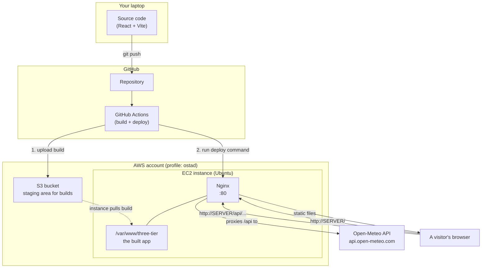
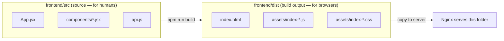
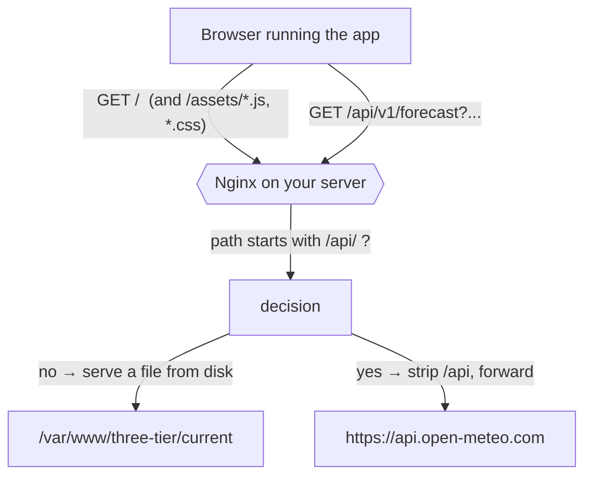
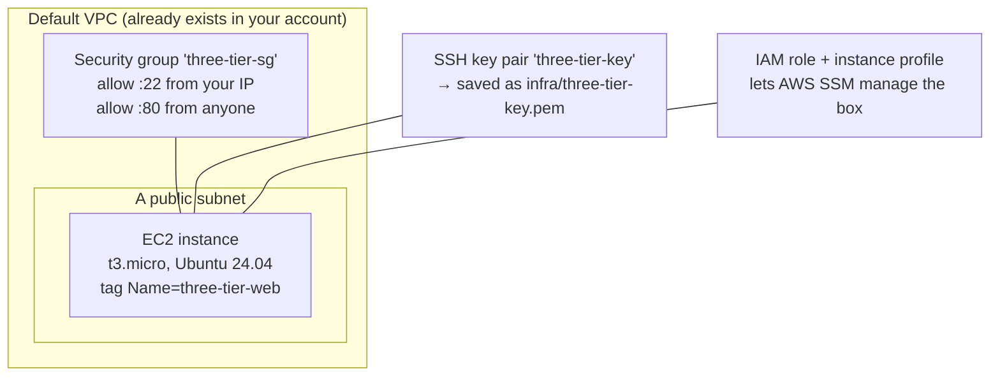
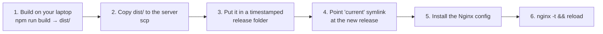
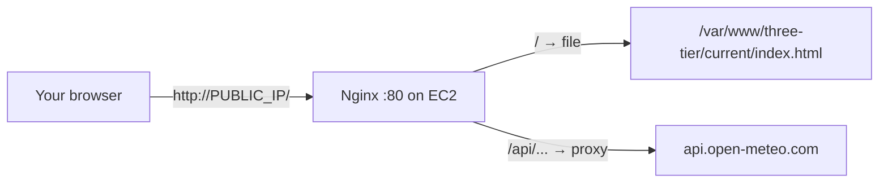
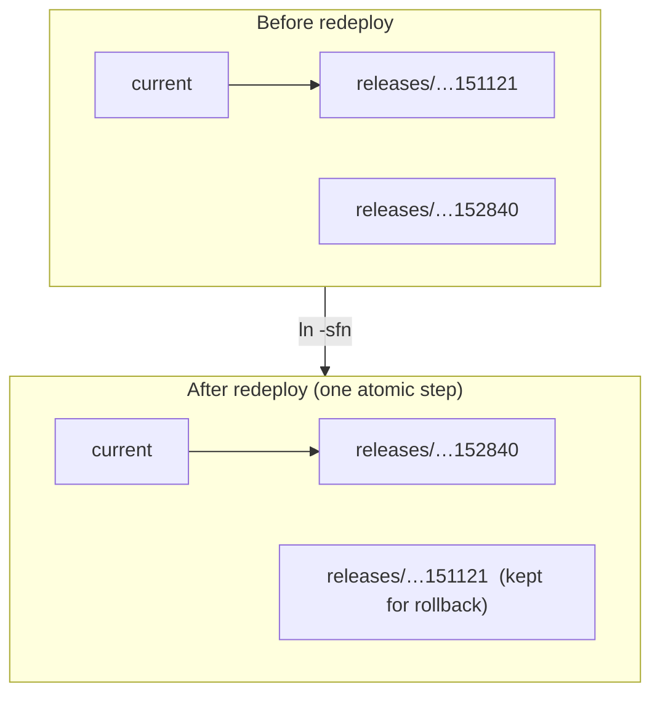
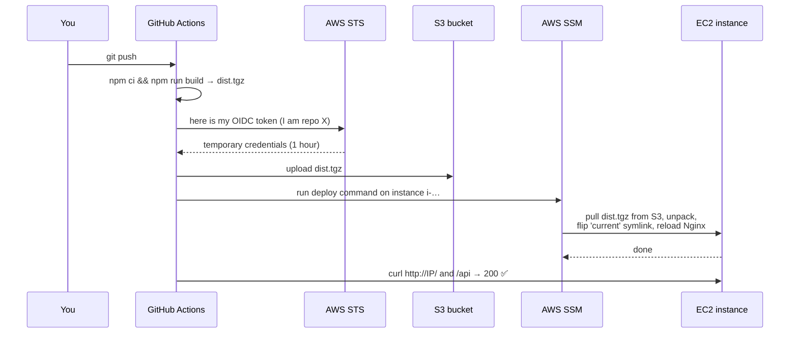
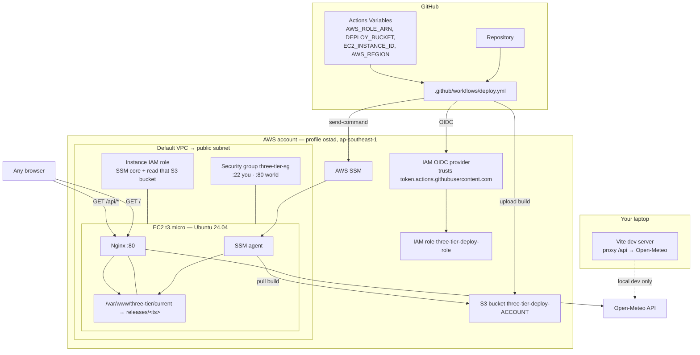

# Frontend Development & AWS Deployment

> A hands-on lab for the **DevOps Master** course.
> You will build a small React app, then deploy it to AWS **five different ways** —
> by hand, with a script, and fully automated with GitHub Actions — and understand
> every moving part in between.

This is **Tier 1** (the web/frontend tier) of a bigger "three-tier" project.
Later modules add a backend tier and a database tier; the repo is laid out so they
slot in without moving anything.

---

## Table of contents

1. [Overview & architecture](#1-overview--architecture)
2. [Frontend architecture](#2-frontend-architecture)
3. [Run it locally](#3-run-it-locally)
4. [Nginx basics](#4-nginx-basics)
5. [Create an EC2 instance](#5-create-an-ec2-instance)
6. [Manual deploy walkthrough](#6-manual-deploy-walkthrough)
7. [Updating the app](#7-updating-the-app)
8. [Automate with a script](#8-automate-with-a-script)
9. [GitHub Actions CI/CD](#9-github-actions-cicd)
10. [Full architecture view](#10-full-architecture-view)
11. [Cleanup](#11-cleanup)

---

## ⚠️ Read this first — money and safety

- This lab creates **real AWS resources** (one small EC2 server, a security group,
  an S3 bucket, an IAM role). Left running, the EC2 instance costs roughly
  **US$0.30 per day** (`t3.micro` in `ap-southeast-1`). Everything else is
  effectively free.
- **When you finish for the day, run [section 11 — Cleanup](#11-cleanup).**
  It deletes everything. You can rebuild it in ~3 minutes next time.
- Never commit AWS keys, `.pem` files, or `infra/.lab-state` to git. The provided
  `.gitignore` already blocks them.

---

## What you need before you start

| Tool | Check it works | If missing |
|---|---|---|
| **AWS CLI v2** | `aws --version` | <https://aws.amazon.com/cli/> |
| An AWS profile named **`ostad`** | `aws sts get-caller-identity --profile ostad` | `aws configure --profile ostad` |
| **Node.js 20+** and npm | `node --version` | <https://nodejs.org/> |
| **git** | `git --version` | <https://git-scm.com/> |
| A **GitHub account** (for section 9) | `gh auth status` | <https://cli.github.com/> |

Expected output of the profile check (your numbers differ):

```console
$ aws sts get-caller-identity --profile ostad
{
    "UserId": "AIDAWQ3MELK6BKB6SPOEY",
    "Account": "448513989308",
    "Arn": "arn:aws:iam::448513989308:user/you@example.com"
}
```

Every AWS command in this guide uses `--profile ostad` (region `ap-southeast-1`).
The scripts default to that automatically. To use a different profile/region:

```bash
export AWS_PROFILE=my-other-profile
export AWS_REGION=us-east-1
```

---

## 1. Overview & architecture

**What you'll learn:** the shape of the whole system before we build any of it.

The app is a **Weather Board**: a single-page React app that shows current weather
and a 3-day forecast for a few cities. The weather data comes from the free
[Open-Meteo](https://open-meteo.com/) API (no API key needed).

Here is the end state you're heading toward:



**The one big idea:** the browser only ever talks to **your server**. Requests for
the app's files and requests for weather data both go to the same place (Nginx);
Nginx decides whether to serve a file or forward the request to Open-Meteo. That's
why there are no "CORS errors" and no API URLs baked into the app.

### The learning path

| Section | You do this | By hand or automated? |
|---|---|---|
| 3 | Run the app on your laptop | — |
| 4 | Learn what Nginx does | — |
| 5 | Create a server on AWS | one script |
| 6 | Deploy the app by typing every command | **by hand** |
| 7 | Change the app and redeploy | by hand |
| 8 | Replace the typing with one script | **script** |
| 9 | Let GitHub deploy on every push | **fully automated** |
| 11 | Delete everything | one script |

### Repository layout

```
frontend/                 the React app (Tier 1)
  src/                     components, the single api.js that calls /api
  vite.config.js           dev-server proxy: /api -> Open-Meteo
nginx/three-tier.conf      the production Nginx site config
scripts/
  ec2-userdata.sh          first-boot bootstrap (Nginx + AWS CLI + placeholder)
  deploy.sh                build locally -> ship over SSH -> swap symlink
  cleanup.sh               delete everything (calls infra/teardown.sh)
infra/
  _common.sh               shared settings (profile, region, resource names)
  01-ec2.sh                create key pair + security group + IAM role + EC2
  02-cicd.sh               create S3 bucket + GitHub OIDC + deploy role
  teardown.sh              the real "delete everything"
.github/workflows/deploy.yml   the CI/CD pipeline
```

---

## 2. Frontend architecture

**What you'll learn:** how a single-page app (SPA) is put together, and what
`npm run build` actually produces.

### The app is just files

A React app written with [Vite](https://vitejs.dev/) has **source code** (JSX, which
browsers can't run) and a **build step** that turns it into plain
`.html` + `.css` + `.js` a browser understands.



Deploying a frontend = **run the build, copy the `dist/` folder to a web server.**
That's the whole job. Everything else in this guide is about doing that copy
reliably and automatically.

### How the app talks to the outside world

There is exactly **one** file that makes network calls: [`frontend/src/api.js`](frontend/src/api.js).
Look at it — every request goes to a path that starts with `/api`:

```js
const res = await fetch(`/api/v1/forecast?${params}`);
```

We never write `https://api.open-meteo.com` in the app. Why does that matter?



Because the app calls a **relative** URL, the browser sends that request back to
**whatever server delivered the app** — your laptop in dev, your EC2 box in
production. The app code never changes between environments. The thing that
"connects" the app to Open-Meteo is a **reverse proxy** rule, and it lives in
config, not in code:

- **local dev:** Vite's dev server does it — see the `proxy` block in
  [`frontend/vite.config.js`](frontend/vite.config.js).
- **production:** Nginx does it — see the `location /api/` block in
  [`nginx/three-tier.conf`](nginx/three-tier.conf).

> **Reverse proxy** = a server that receives a request and, instead of answering it
> itself, forwards it to another server and relays the reply back. The browser
> thinks it's talking to one server the whole time.

---

## 3. Run it locally

**What you'll learn:** the normal frontend dev loop, and proof the `/api` idea works
with zero servers involved.

**You need:** Node.js 20+, git.

```bash
git clone https://github.com/ashikMostofaTonmoy/three-tier-deployment.git
cd three-tier-deployment/frontend
npm install
npm run dev
```

Open the URL it prints (`http://localhost:5173/`). You should see the Weather Board
with live data. Try switching cities.

Quick check that both the page **and** the proxied API work:

```console
$ curl -s -o /dev/null -w "GET /        -> %{http_code}\n" http://localhost:5173/
GET /        -> 200
$ curl -s -o /dev/null -w "GET /api/... -> %{http_code}\n" "http://localhost:5173/api/v1/forecast?latitude=51.5&longitude=-0.13&current=temperature_2m&timezone=auto"
GET /api/... -> 200
```

That second request proves the dev-server proxy: your browser asked
`localhost:5173/api/...`, and Vite forwarded it to `api.open-meteo.com` for you
(config in [`frontend/vite.config.js`](frontend/vite.config.js)).

### Make the production build

```console
$ npm run build

vite v5.4.21 building for production...
✓ 35 modules transformed.
dist/index.html                 0.42 kB
dist/assets/index-*.css         1.75 kB
dist/assets/index-*.js        145.89 kB
✓ built in 820ms

$ npm run preview        # serves the built dist/ folder, like a real web server
```

`npm run build` created the `frontend/dist/` folder. **That folder is the entire
thing we deploy** in every following section.

**What just happened:** you ran the app two ways — `dev` (source, hot-reload,
for coding) and `preview` (the real build, for a final check). Production servers
only ever see the `dist/` output.

**If it breaks:**
- `npm install` fails with `EPERM` on Windows → close your editor / antivirus lock
  on `node_modules`, delete the folder, try again.
- Port 5173 in use → Vite will pick the next free port; use the URL it prints.

---

## 4. Nginx basics

**What you'll learn:** what a web server config is, line by line. You'll do this
for real on the server in section 6 — this section is just the map.

**Nginx** is the program that listens on port 80, receives HTTP requests, and
either sends back a file or proxies the request somewhere else.

On Ubuntu, Nginx configs live in:

```
/etc/nginx/nginx.conf                 main file (don't edit)
/etc/nginx/sites-available/           configs you write
/etc/nginx/sites-enabled/            symlinks to the ones you switched on
```

You write a config in `sites-available/`, symlink it into `sites-enabled/`, test
it, and reload. Our config is [`nginx/three-tier.conf`](nginx/three-tier.conf):

```nginx
server {
    listen 80 default_server;     # answer HTTP on port 80
    server_name _;                # for any hostname

    root  /var/www/three-tier/current;   # where the files are
    index index.html;

    location / {
        # try the exact file; if it doesn't exist, hand back index.html
        # so the React app can handle the URL itself (SPA routing).
        try_files $uri $uri/ /index.html;
    }

    location /api/ {
        resolver 127.0.0.53 valid=30s;        # the box's DNS resolver
        set $upstream "api.open-meteo.com";
        rewrite ^/api/(.*)$ /$1 break;         # /api/v1/forecast -> /v1/forecast
        proxy_pass https://$upstream;          # ...then forward to Open-Meteo
        proxy_ssl_server_name on;              # required for HTTPS upstreams
        proxy_set_header Host $upstream;
    }

    location = /healthz {
        return 200 "ok\n";                     # a cheap "is it alive?" endpoint
    }
}
```

Two `location` rules you must understand:

| Rule | Purpose | Without it |
|---|---|---|
| `try_files $uri $uri/ /index.html` | **SPA fallback.** A React route like `/trends` isn't a real file. This serves `index.html` so React can render it. | Refreshing any deep link gives `404 Not Found`. |
| `location /api/ { ... proxy_pass ... }` | **Reverse proxy.** Turns `your-server/api/x` into `api.open-meteo.com/x`. | The browser calls Open-Meteo directly and gets blocked by CORS. |

> **Why `rewrite ... break` and not just `proxy_pass .../;`?**
> When `proxy_pass` contains a **variable** (`$upstream`), Nginx will not rewrite
> the path for you, so we do it explicitly. We use a variable so Nginx re-resolves
> the CDN's changing IPs via DNS instead of caching one forever.

Commands you'll use on the server:

```bash
sudo nginx -t                     # check the config is valid — ALWAYS before reload
sudo systemctl reload nginx       # apply new config, zero downtime
sudo systemctl restart nginx      # full restart (rarely needed)
sudo tail -f /var/log/nginx/error.log      # watch errors live
```

---

## 5. Create an EC2 instance

**What you'll learn:** the AWS pieces a single web server needs, and how to make
them with one script.

**You need:** the `ostad` AWS profile working.

### What we're about to create



- **Security group** = a firewall on the instance. Port 22 (SSH) only from *your*
  IP; port 80 (HTTP) from the whole internet so people can visit the site.
- **Key pair** = the SSH key you'll use to log in and copy files. The private half
  is saved locally as `infra/three-tier-key.pem` — keep it secret.
- **IAM role** = lets Amazon's Systems Manager (SSM) run commands on the box. The
  CI/CD pipeline in section 9 uses this so it never needs an SSH key.

### Run it

```bash
cd three-tier-deployment
./infra/01-ec2.sh
```

Expected output (your IDs differ):

```console
==================================================================
  profile : ostad
  account : 448513989308
  region  : ap-southeast-1
==================================================================
Ubuntu 24.04 AMI : ami-0ba4172b23e57d5a8
VPC / subnet     : vpc-03aa87066fc5d088f / subnet-065f022c7585b4743
Key pair         : three-tier-key  ->  infra/three-tier-key.pem
Security group   : three-tier-sg (sg-0499f5fc690688cac)  — SSH from 45.248.151.16/32, HTTP from anywhere
IAM role         : three-tier-ssm-role (created)
Instance profile : three-tier-ssm-profile (created) — waiting 10s for it to propagate
Instance         : i-047c384a4a4d678aa (launching)
Waiting for the instance to be running and healthy…

  DONE
  INSTANCE_ID = i-047c384a4a4d678aa
  PUBLIC_IP   = 54.151.153.232
  open http://54.151.153.232/  (nothing there yet until you deploy)
```

The script writes every ID it created to `infra/.lab-state` so the other scripts
(and cleanup) can find them. **Don't delete that file** until you've cleaned up.

Visit `http://<PUBLIC_IP>/` — you'll get an Nginx error page or nothing. That's
expected: the server exists but the app isn't on it yet. That's section 6.

### Connecting to the instance (two ways)

- **Browser (easiest):** AWS Console → EC2 → your instance → **Connect** →
  *EC2 Instance Connect* → **Connect**. Opens a terminal in your browser.
- **SSH from your laptop:**
  ```bash
  ssh -i infra/three-tier-key.pem ubuntu@<PUBLIC_IP>
  ```
  If it times out, your internet IP changed since you ran the script. Re-open
  port 22 for your current IP:
  ```bash
  MYIP=$(curl -s https://checkip.amazonaws.com)
  aws ec2 authorize-security-group-ingress --profile ostad --region ap-southeast-1 \
    --group-id <SG_ID> --protocol tcp --port 22 --cidr "$MYIP/32"
  ```

**Clean up this section:** covered by [section 11](#11-cleanup) — don't do it yet.

---

## 6. Manual deploy walkthrough

**What you'll learn:** exactly what "deploying a frontend" means, by doing every
step yourself.

**You need:** section 5 done; the instance's `PUBLIC_IP`; `infra/three-tier-key.pem`.

The plan:



### Step 1 — build (on your laptop)

```bash
cd three-tier-deployment/frontend
BUILD_ID="manual-$(date -u +%Y%m%dT%H%M%SZ)" npm run build
cd ..
```

`BUILD_ID` gets stamped into the app so you can see which build is live (bottom of
the page, and in the JS bundle). Any string works.

### Step 2 — one-time server prep

SSH into the instance (`ssh -i infra/three-tier-key.pem ubuntu@<PUBLIC_IP>`) and
install Nginx:

```bash
sudo apt-get update -y
sudo apt-get install -y nginx
```

Expected: `nginx` installs; `systemctl is-active nginx` prints `active`.

### Step 3 — copy the build up (from your laptop)

```bash
scp -i infra/three-tier-key.pem -r frontend/dist ubuntu@<PUBLIC_IP>:/tmp/dist-upload
scp -i infra/three-tier-key.pem nginx/three-tier.conf ubuntu@<PUBLIC_IP>:/tmp/three-tier.conf
```

### Step 4 — publish it (on the server)

```bash
# a new release folder named by the current time
RELEASE="/var/www/three-tier/releases/$(date -u +%Y%m%d%H%M%S)"
sudo mkdir -p "$RELEASE"
sudo cp -r /tmp/dist-upload/. "$RELEASE/"

# 'current' is a symlink. Point it at the new release.
sudo ln -sfn "$RELEASE" /var/www/three-tier/current
ls -l /var/www/three-tier/
```

```console
current -> /var/www/three-tier/releases/20260906151121
releases
```

### Step 5 — turn on the Nginx site (on the server)

```bash
sudo cp /tmp/three-tier.conf /etc/nginx/sites-available/three-tier
sudo ln -sfn /etc/nginx/sites-available/three-tier /etc/nginx/sites-enabled/three-tier
sudo rm -f /etc/nginx/sites-enabled/default        # drop Nginx's welcome page
sudo nginx -t
sudo systemctl reload nginx
```

```console
nginx: the configuration file /etc/nginx/nginx.conf syntax is ok
nginx: configuration file /etc/nginx/nginx.conf test is successful
```

### Step 6 — verify

On the server:

```console
$ curl -s -o /dev/null -w "%{http_code}\n" http://localhost/
200
$ curl -s http://localhost/healthz
ok
$ curl -s "http://localhost/api/v1/forecast?latitude=23.81&longitude=90.41&current=temperature_2m&timezone=auto"
{"latitude":23.8,"longitude":90.4,...,"current":{"time":"...","temperature_2m":26.4}}
```

From your own machine, open `http://<PUBLIC_IP>/` in a browser. The Weather Board
loads, cities switch, and the footer shows your `manual-…` build id.



**What just happened:** a deploy is *copy files, point a symlink, reload Nginx*.
The timestamped-release + `current` symlink pattern means the switch is instant and
you can roll back by pointing the symlink at an older folder.

**If it breaks:**
- `curl /` gives 404 → `sudo nginx -t`; check `root` points at
  `/var/www/three-tier/current` and the symlink exists.
- `/api/` gives `502 Bad Gateway` → the box can't reach Open-Meteo; check
  `resolver` line and outbound internet.
- `scp` times out → your IP changed; re-authorize port 22 (see section 5).

---

## 7. Updating the app

**What you'll learn:** the redeploy loop, and why the symlink makes it safe.

Change something visible. Open [`frontend/src/App.jsx`](frontend/src/App.jsx) and
edit the subtitle:

```jsx
<p className="subtitle">A tiny frontend, deployed the DevOps way. (v2)</p>
```

Rebuild and repeat section 6 steps 1, 3, 4, 6 with a **new** `BUILD_ID`. You'll get
a *second* folder under `releases/`, and `current` now points at it:

```console
$ ls -l /var/www/three-tier/releases/
drwxr-xr-x 20260906151121
drwxr-xr-x 20260906152840      <- new
$ readlink /var/www/three-tier/current
/var/www/three-tier/releases/20260906152840
```



Refresh the browser — the subtitle and build id changed. No downtime: Nginx was
serving the old folder until the instant the symlink flipped.

**Rollback** is just pointing `current` back:

```bash
sudo ln -sfn /var/www/three-tier/releases/20260906151121 /var/www/three-tier/current
sudo systemctl reload nginx
```

Typing all those steps every time is tedious and error-prone. Section 8 fixes that.

---

## 8. Automate with a script

**What you'll learn:** two levels of automation — a fresh server that configures
itself, and a one-command deploy.

### 8a. A self-configuring server (`scripts/ec2-userdata.sh`)

EC2 can run a script the **first time an instance boots** ("user data"). Our
[`scripts/ec2-userdata.sh`](scripts/ec2-userdata.sh) installs Nginx + the AWS CLI,
writes the site config, and puts up a "waiting for first deploy" placeholder — so
a brand-new instance is a working web server with **zero manual steps**.

Launch a new instance that bootstraps itself:

```bash
./infra/teardown.sh          # remove the hand-built one from sections 5–7
./infra/01-ec2.sh --user-data scripts/ec2-userdata.sh
```

After it boots (~90s), visit `http://<NEW_PUBLIC_IP>/`:

```console
$ curl -s http://<NEW_PUBLIC_IP>/ | head -5
<!doctype html><meta charset="utf-8"><title>Weather Board</title>
...
  <p>Server is up. Waiting for the first deploy…</p>
$ curl -s -o /dev/null -w "%{http_code}\n" http://<NEW_PUBLIC_IP>/healthz
200
```

**What just happened:** the config work you did by hand in section 6 (steps 2 & 5)
is now baked into the instance's birth. All that's left is shipping the app.

### 8b. One-command deploy (`scripts/deploy.sh`)

[`scripts/deploy.sh`](scripts/deploy.sh) is sections 6–7 in a single command:
build → package → upload over SSH → new release folder → flip symlink → reload →
verify. It reads the instance IP and key from `infra/.lab-state`.

```console
$ ./scripts/deploy.sh
==> building frontend (BUILD_ID=8f3a1c2-20260906T153000Z)
==> packaging
==> uploading to 54.151.153.232
==> activating new release on the server
current -> /var/www/three-tier/releases/20260906153012
==> verifying over HTTP
    GET /        -> 200
    GET /api/... -> 200
    live build   -> 8f3a1c2-20260906T153000Z
==> OK  http://54.151.153.232/
```

Run it again after any code change. It keeps the last 5 releases and prunes older
ones. Override the label or retention:

```bash
BUILD_ID="hotfix-1" KEEP=10 ./scripts/deploy.sh
# or target a specific host/key:
./scripts/deploy.sh 54.151.153.232 infra/three-tier-key.pem
```

**If it breaks:**
- `npm ci` error about a locked file (Windows) → close editors, delete
  `frontend/node_modules`, retry.
- upload times out → your IP changed; re-authorize port 22 (section 5).

---

## 9. GitHub Actions CI/CD

**What you'll learn:** how to let GitHub build and deploy on every push — with **no
AWS keys stored anywhere**.

### Why not just put an AWS key in GitHub secrets?

Long-lived keys leak. Instead we use **OIDC**: GitHub proves its identity to AWS
with a short-lived token, and AWS hands back credentials that expire in an hour.
Nothing secret is ever stored in the repo.



Note there's **no SSH** in that picture. GitHub talks to AWS; AWS's SSM agent —
already on the instance from section 5 — runs the commands.

### Step 1 — put this repo on your own GitHub

```bash
gh repo create three-tier-deployment --private --source . --push
```

(You can make it public later — `gh repo edit --visibility public`.)

### Step 2 — create the CI/CD infrastructure

```bash
./infra/02-cicd.sh <your-github-username>/three-tier-deployment
```

This creates:

| Resource | Purpose |
|---|---|
| S3 bucket `three-tier-deploy-<account-id>` | staging area; each build lands here as a `.tgz` (auto-deleted after 14 days) |
| GitHub **OIDC provider** | teaches your AWS account to trust GitHub's tokens (reused if you already have one) |
| IAM role `three-tier-deploy-role` | what Actions assumes: write to that bucket, send one SSM command to your instance |
| extra permission on the instance role | lets the instance *read* that bucket |

Output ends with the four values to register:

```console
  DONE. Set these as GitHub Actions *Variables* (not secrets):

    gh variable set AWS_REGION      --body "ap-southeast-1"
    gh variable set AWS_ROLE_ARN    --body "arn:aws:iam::448513989308:role/three-tier-deploy-role"
    gh variable set DEPLOY_BUCKET   --body "three-tier-deploy-448513989308"
    gh variable set EC2_INSTANCE_ID --body "i-047c384a4a4d678aa"
```

Run those four `gh variable set` lines (copy them from *your* output).

> **Built your instance by hand in section 6** (not with `--user-data`)? It has no
> AWS CLI. Install it once:
> ```bash
> aws ssm send-command --profile ostad --region ap-southeast-1 \
>   --instance-ids <INSTANCE_ID> --document-name AWS-RunShellScript \
>   --parameters 'commands=["curl -fsSL https://awscli.amazonaws.com/awscli-exe-linux-x86_64.zip -o /tmp/a.zip","unzip -q -o /tmp/a.zip -d /tmp","/tmp/aws/install --update"]'
> ```

### Step 3 — the workflow

[`.github/workflows/deploy.yml`](.github/workflows/deploy.yml) runs on every push
that touches `frontend/**`, and on demand. Its jobs, in order:

1. **Build the static site** — `npm ci`, `npm run build`, tar it up.
2. **Get temporary AWS credentials (OIDC)** — no secrets.
3. **Stage the build in S3** — `aws s3 cp dist.tgz s3://…/releases/<sha>.tgz`.
4. **Tell the instance to go live (SSM)** — one `send-command` that pulls the tgz,
   makes a release folder, flips the symlink, reloads Nginx.
5. **Verify** — `curl` the public IP for `/`, `/api`, and the exact build id.

### Step 4 — trigger it

```bash
gh workflow run deploy.yml
gh run watch
```

A successful run:

```console
✓ deploy in 40s
  ✓ Build the static site
  ✓ Get temporary AWS credentials (OIDC)
  ✓ Stage the build in S3
  ✓ Tell the instance to go live (SSM)
  ✓ Verify it is serving the new build
      GET /        -> 200
      GET /api/... -> 200
      live build -> 39ec099-20260906T153736Z  ✅
```

Now edit `frontend/src/App.jsx`, commit, push — and watch it deploy itself.

**If it breaks:**
- `Not authorized to perform sts:AssumeRoleWithWebIdentity` → the role's trust
  policy doesn't match your repo. Re-run `./infra/02-cicd.sh <user>/<repo>` with
  the exact owner/repo, wait a minute, retry.
- SSM step: `aws: not found` → the instance has no AWS CLI (see the note in step 2).
- Verify step fails → give it a few seconds and re-run; SSM is eventually consistent.

---

## 10. Full architecture view

**What you'll learn:** every component in one picture, and the command to inspect
each one while it's running.



| Component | What it does | Inspect it live |
|---|---|---|
| **Vite** (`frontend/vite.config.js`) | dev server + `/api` proxy for local coding | `npm run dev` |
| **`dist/`** | the built static site — the deploy artifact | `ls frontend/dist` |
| **EC2 instance** | the Ubuntu box running Nginx | `aws ec2 describe-instances --profile ostad --instance-ids <id>` |
| **Security group** | firewall: 22 from you, 80 from all | `aws ec2 describe-security-groups --profile ostad --group-ids <sg>` |
| **Nginx** | serves files, proxies `/api`, SPA fallback | `ssh … 'sudo nginx -T'` · `curl http://<ip>/healthz` |
| **`current` symlink** | which release is live | `ssh … 'readlink -f /var/www/three-tier/current'` |
| **SSM agent** | lets AWS/CI run commands, no SSH | `aws ssm describe-instance-information --profile ostad` |
| **S3 bucket** | staging area for CI builds | `aws s3 ls s3://three-tier-deploy-<account>/releases/ --profile ostad` |
| **OIDC provider** | makes AWS trust GitHub tokens | `aws iam list-open-id-connect-providers --profile ostad` |
| **`three-tier-deploy-role`** | what GitHub Actions assumes | `aws iam get-role --role-name three-tier-deploy-role --profile ostad` |
| **GitHub Actions** | build + deploy on push | `gh run list` · `gh run watch` |
| **Open-Meteo** | the upstream weather API | `curl "https://api.open-meteo.com/v1/forecast?latitude=0&longitude=0&current=temperature_2m"` |

### See a deploy happen end to end

```bash
# 1. change something
sed -i 's/Weather Board/Weather Board ⛅/' frontend/src/App.jsx
git commit -am "tweak title" && git push

# 2. watch CI
gh run watch

# 3. confirm the box is serving the new build
IP=$(sed -n 's/^PUBLIC_IP=//p' infra/.lab-state | tail -1)
curl -s "http://$IP/$(curl -s http://$IP/ | grep -o 'assets/index-[^\"]*\.js')" | grep -o 'Weather Board ⛅'
```

---

## 11. Cleanup

**Run this every time you're done.** It deletes everything the lab created.

```bash
./scripts/cleanup.sh
```

Expected:

```console
Terminating instances…
  - instance i-047c384a4a4d678aa
Deleting CI/CD resources…
  - s3://three-tier-deploy-448513989308
  - role three-tier-deploy-role
  - OIDC provider (created by this lab)
Deleting instance resources…
  - instance profile three-tier-ssm-profile
  - role three-tier-ssm-role
  - security group sg-0499f5fc690688cac
  - key pair three-tier-key
  - local infra/three-tier-key.pem
Done. infra/.lab-state removed.
```

> The GitHub **OIDC provider** is deleted **only if this lab created it**. If your
> account already had one (other projects use it), it's left alone.

### Verify nothing is left

```bash
P="--profile ostad --region ap-southeast-1"
aws ec2 describe-instances $P \
  --filters Name=tag:Name,Values=three-tier-web Name=instance-state-name,Values=running,pending \
  --query 'Reservations[].Instances[].InstanceId'          # []
aws ec2 describe-security-groups $P --filters Name=group-name,Values=three-tier-sg \
  --query 'SecurityGroups[].GroupId'                        # []
aws s3 ls $P | grep three-tier-deploy || echo "no bucket"   # no bucket
aws iam get-role --role-name three-tier-deploy-role $P 2>&1 | grep -o 'NoSuchEntity'   # NoSuchEntity
```

All four should come back empty / `NoSuchEntity`. If the security-group delete
complained (it can, right after the instance terminates), wait a minute and run
`./scripts/cleanup.sh` again — it's safe to repeat.

### Cost check

With everything torn down, your only possible charge is a few cents of EC2/EBS
time while the lab ran. Confirm in the AWS Console → **Billing → Bills**.

---

## Where this goes next

- **Tier 2 — backend:** add an API service (Node/Express) on its own instance;
  Nginx proxies `/api` to it instead of straight to Open-Meteo.
- **Tier 3 — database:** add PostgreSQL; the backend talks to it over a private
  security group.
- **Docker:** package each tier as a container; deploy with `docker compose`.

The folder layout (`frontend/`, `nginx/`, `scripts/`, `infra/`) already leaves room
for `backend/` and `database/` beside it.
