# Three-Tier Application: AWS Deployment & CI/CD Automation

<!--
> A hands-on lab for the **DevOps Master** course.
> **Part 1** deploys just the frontend, by hand, with a script, and with GitHub
> Actions. **Part 2** turns it into a **real three-tier app** (frontend + backend +
> database) on one VM, and automates it **two different ways** so you can compare
> them: a GitHub-hosted runner using OIDC + SSM, and a self-hosted runner.

The repo is laid out as a "three-tier" project from the start — `frontend/` (Part 1),
`backend/` + `database/` (Part 2) — so nothing moves as the lab grows.
-->

---

## Table of contents

**Part 1 — the frontend, on its own**
1. [Overview & architecture](#1-overview--architecture)
2. [Frontend architecture](#2-frontend-architecture)
3. [Run it locally](#3-run-it-locally)
4. [Nginx basics](#4-nginx-basics)
5. [Create an EC2 instance](#5-create-an-ec2-instance)
6. [Manual deploy walkthrough](#6-manual-deploy-walkthrough)
7. [Updating the app](#7-updating-the-app)
8. [Automate with a script](#8-automate-with-a-script)
9. [GitHub Actions CI/CD](#9-github-actions-cicd)
10. [Full architecture view](#10-full-architecture-view)
11. [Cleanup](#11-cleanup)

**Part 2 — the full three-tier stack, on one VM, automated two ways**
12. [Full three-tier architecture](#12-full-three-tier-architecture)
13. [The backend tier](#13-the-backend-tier)
14. [The database tier](#14-the-database-tier)
15. [Deploying the full stack on your VM](#15-deploying-the-full-stack-on-your-vm)
16. [Configuring AWS SSM](#16-configuring-aws-ssm)
17. [Automating — Option A: GitHub-hosted runner + OIDC + SSM](#17-automating--option-a-github-hosted-runner--oidc--ssm)
18. [Automating — Option B: a self-hosted runner](#18-automating--option-b-a-self-hosted-runner)
19. [Option A vs Option B](#19-option-a-vs-option-b)
20. [Full picture — everything, both paths](#20-full-picture--everything-both-paths)
21. [Cleanup (Part 2)](#21-cleanup-part-2)

**Part 3 — Monitoring Fundamentals & Prometheus**
22. [Why Monitoring Matters](#22-why-monitoring-matters)
23. [Introduction to Prometheus](#23-introduction-to-prometheus)
24. [Setting Up Prometheus](#24-setting-up-prometheus)
25. [Hands-on: Install Prometheus on EC2](#25-hands-on-install-prometheus-on-ec2)
26. [Node Exporter Deep Dive](#26-node-exporter-deep-dive)
27. [Configure Prometheus to Scrape Node Exporter](#27-configure-prometheus-to-scrape-node-exporter)
28. [PromQL](#28-promql)

**Part 4 — Visualization, Alerting & Production Monitoring**
29. [Introduction to Grafana](#29-introduction-to-grafana)
30. [Setting Up Grafana](#30-setting-up-grafana)
31. [Hands-on: Deploy Grafana on EC2](#31-hands-on-deploy-grafana-on-ec2)
32. [Add Prometheus Data Source](#32-add-prometheus-data-source)
33. [Creating Your First Dashboard](#33-creating-your-first-dashboard)
34. [Use Community Dashboards](#34-use-community-dashboards)
35. [Create the Three-Tier Application Dashboard](#35-create-the-three-tier-application-dashboard)
36. [Monitoring Application Metrics — Backend, Frontend, Database](#36-monitoring-application-metrics--backend-frontend-database)
37. [Setting Up Alerts for Application Health](#37-setting-up-alerts-for-application-health)
38. [Full picture (Parts 1–4) + Cleanup](#38-full-picture-parts-14--cleanup)

---

## ⚠️ Read this first — money and safety

- This lab creates **real AWS resources** (one small EC2 server, a security group,
  an S3 bucket, an IAM role). Left running, the EC2 instance costs roughly
  **US$0.30/day** for Part 1's `t3.micro`, or **US$0.60/day** for Part 2's
  `t3.small` (needed once Postgres joins Nginx and Node on the box). Everything
  else is effectively free.
- **When you finish for the day, run [section 11](#11-cleanup) (Part 1) or
  [section 21](#21-cleanup-part-2) (Part 2) — Cleanup.** It deletes everything.
  You can rebuild it in a few minutes next time.
- Never commit AWS keys, `.pem` files, or `infra/.lab-state` to git. The provided
  `.gitignore` already blocks them.

---

## What you need before you start

| Tool | Check it works | If missing |
|---|---|---|
| **AWS CLI v2** | `aws --version` | <https://aws.amazon.com/cli/> |
| An AWS profile named **`ostad`** | `aws sts get-caller-identity --profile ostad` | `aws configure --profile ostad` |
| **Node.js 20+** and npm | `node --version` | <https://nodejs.org/> |
| **git** | `git --version` | <https://git-scm.com/> |
| A **GitHub account** (for section 9) | `gh auth status` | <https://cli.github.com/> |

Expected output of the profile check (your numbers differ):

```console
$ aws sts get-caller-identity --profile ostad
{
    "UserId": "AIDAWQ3MELK6BKB6SPOEY",
    "Account": "448513989308",
    "Arn": "arn:aws:iam::448513989308:user/you@example.com"
}
```

Every AWS command in this guide uses `--profile ostad` (region `ap-southeast-1`).
The scripts default to that automatically. To use a different profile/region:

```bash
export AWS_PROFILE=my-other-profile
export AWS_REGION=us-east-1
```

---

## 1. Overview & architecture

**What you'll learn:** the shape of the whole system before we build any of it.

The app is a **Weather Board**: a single-page React app that shows current weather
and a 3-day forecast for a few cities. The weather data comes from the free
[Open-Meteo](https://open-meteo.com/) API (no API key needed).

Here is the end state you're heading toward:

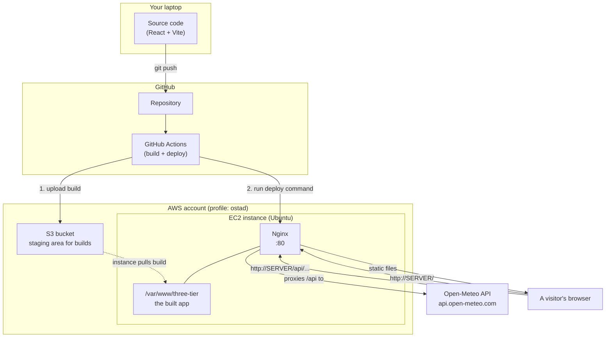

**The one big idea:** the browser only ever talks to **your server**. Requests for
the app's files and requests for weather data both go to the same place (Nginx);
Nginx decides whether to serve a file or forward the request to Open-Meteo. That's
why there are no "CORS errors" and no API URLs baked into the app.

### The learning path

| Section | You do this | By hand or automated? |
|---|---|---|
| 3 | Run the app on your laptop | — |
| 4 | Learn what Nginx does | — |
| 5 | Create a server on AWS | one script |
| 6 | Deploy the app by typing every command | **by hand** |
| 7 | Change the app and redeploy | by hand |
| 8 | Replace the typing with one script | **script** |
| 9 | Let GitHub deploy on every push | **fully automated** |
| 11 | Delete everything | one script |

### Repository layout

```
frontend/                 the React app (Tier 1)
  src/                     components, the single api.js that calls /api
  vite.config.js           dev-server proxy: /api -> Open-Meteo
nginx/three-tier.conf      the production Nginx site config
scripts/
  ec2-userdata.sh          first-boot bootstrap (Nginx + AWS CLI + placeholder)
  deploy.sh                build locally -> ship over SSH -> swap symlink
  cleanup.sh               delete everything (calls infra/teardown.sh)
infra/
  _common.sh               shared settings (profile, region, resource names)
  01-ec2.sh                create key pair + security group + IAM role + EC2
  02-cicd.sh               create S3 bucket + GitHub OIDC + deploy role
  teardown.sh              the real "delete everything"
.github/workflows/deploy.yml   the CI/CD pipeline
```

---

## 2. Frontend architecture

**What you'll learn:** how a single-page app (SPA) is put together, and what
`npm run build` actually produces.

### The app is just files

A React app written with [Vite](https://vitejs.dev/) has **source code** (JSX, which
browsers can't run) and a **build step** that turns it into plain
`.html` + `.css` + `.js` a browser understands.

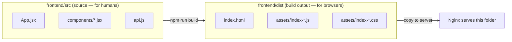

Deploying a frontend = **run the build, copy the `dist/` folder to a web server.**
That's the whole job. Everything else in this guide is about doing that copy
reliably and automatically.

### How the app talks to the outside world

There is exactly **one** file that makes network calls: [`frontend/src/api.js`](frontend/src/api.js).
Look at it — every request goes to a path that starts with `/api`:

```js
const res = await fetch(`/api/v1/forecast?${params}`);
```

We never write `https://api.open-meteo.com` in the app. Why does that matter?

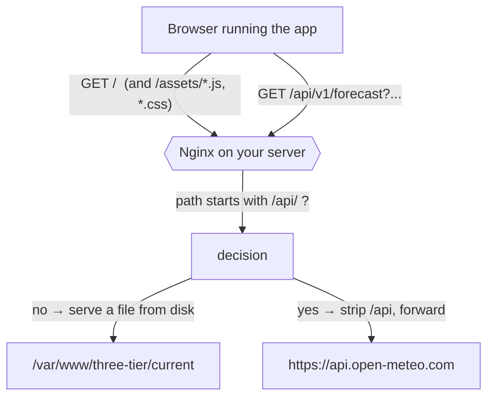

Because the app calls a **relative** URL, the browser sends that request back to
**whatever server delivered the app** — your laptop in dev, your EC2 box in
production. The app code never changes between environments. The thing that
"connects" the app to Open-Meteo is a **reverse proxy** rule, and it lives in
config, not in code:

- **local dev:** Vite's dev server does it — see the `proxy` block in
  [`frontend/vite.config.js`](frontend/vite.config.js).
- **production:** Nginx does it — see the `location /api/` block in
  [`nginx/three-tier.conf`](nginx/three-tier.conf).

> **Reverse proxy** = a server that receives a request and, instead of answering it
> itself, forwards it to another server and relays the reply back. The browser
> thinks it's talking to one server the whole time.

---

## 3. Run it locally

**What you'll learn:** the normal frontend dev loop, and proof the `/api` idea works
with zero servers involved.

**You need:** Node.js 20+, git.

```bash
git clone https://github.com/ashikMostofaTonmoy/three-tier-deployment.git
cd three-tier-deployment/frontend
npm install
npm run dev
```

Open the URL it prints (`http://localhost:5173/`). You should see the Weather Board
with live data. Try switching cities.

Quick check that both the page **and** the proxied API work:

```console
$ curl -s -o /dev/null -w "GET /        -> %{http_code}\n" http://localhost:5173/
GET /        -> 200
$ curl -s -o /dev/null -w "GET /api/... -> %{http_code}\n" "http://localhost:5173/api/v1/forecast?latitude=51.5&longitude=-0.13&current=temperature_2m&timezone=auto"
GET /api/... -> 200
```

That second request proves the dev-server proxy: your browser asked
`localhost:5173/api/...`, and Vite forwarded it to `api.open-meteo.com` for you
(config in [`frontend/vite.config.js`](frontend/vite.config.js)).

### Make the production build

```console
$ npm run build

vite v5.4.21 building for production...
✓ 35 modules transformed.
dist/index.html                 0.42 kB
dist/assets/index-*.css         1.75 kB
dist/assets/index-*.js        145.89 kB
✓ built in 820ms

$ npm run preview        # serves the built dist/ folder, like a real web server
```

`npm run build` created the `frontend/dist/` folder. **That folder is the entire
thing we deploy** in every following section.

**What just happened:** you ran the app two ways — `dev` (source, hot-reload,
for coding) and `preview` (the real build, for a final check). Production servers
only ever see the `dist/` output.

**If it breaks:**
- `npm install` fails with `EPERM` on Windows → close your editor / antivirus lock
  on `node_modules`, delete the folder, try again.
- Port 5173 in use → Vite will pick the next free port; use the URL it prints.

---

## 4. Nginx basics

**What you'll learn:** what a web server config is, line by line. You'll do this
for real on the server in section 6 — this section is just the map.

**Nginx** is the program that listens on port 80, receives HTTP requests, and
either sends back a file or proxies the request somewhere else.

On Ubuntu, Nginx configs live in:

```
/etc/nginx/nginx.conf                 main file (don't edit)
/etc/nginx/sites-available/           configs you write
/etc/nginx/sites-enabled/            symlinks to the ones you switched on
```

You write a config in `sites-available/`, symlink it into `sites-enabled/`, test
it, and reload. Our config is [`nginx/three-tier.conf`](nginx/three-tier.conf):

```nginx
server {
    listen 80 default_server;     # answer HTTP on port 80
    server_name _;                # for any hostname

    root  /var/www/three-tier/current;   # where the files are
    index index.html;

    location / {
        # try the exact file; if it doesn't exist, hand back index.html
        # so the React app can handle the URL itself (SPA routing).
        try_files $uri $uri/ /index.html;
    }

    location /api/ {
        resolver 127.0.0.53 valid=30s;        # the box's DNS resolver
        set $upstream "api.open-meteo.com";
        rewrite ^/api/(.*)$ /$1 break;         # /api/v1/forecast -> /v1/forecast
        proxy_pass https://$upstream;          # ...then forward to Open-Meteo
        proxy_ssl_server_name on;              # required for HTTPS upstreams
        proxy_set_header Host $upstream;
    }

    location = /healthz {
        return 200 "ok\n";                     # a cheap "is it alive?" endpoint
    }
}
```

Two `location` rules you must understand:

| Rule | Purpose | Without it |
|---|---|---|
| `try_files $uri $uri/ /index.html` | **SPA fallback.** A React route like `/trends` isn't a real file. This serves `index.html` so React can render it. | Refreshing any deep link gives `404 Not Found`. |
| `location /api/ { ... proxy_pass ... }` | **Reverse proxy.** Turns `your-server/api/x` into `api.open-meteo.com/x`. | The browser calls Open-Meteo directly and gets blocked by CORS. |

> **Why `rewrite ... break` and not just `proxy_pass .../;`?**
> When `proxy_pass` contains a **variable** (`$upstream`), Nginx will not rewrite
> the path for you, so we do it explicitly. We use a variable so Nginx re-resolves
> the CDN's changing IPs via DNS instead of caching one forever.

Commands you'll use on the server:

```bash
sudo nginx -t                     # check the config is valid — ALWAYS before reload
sudo systemctl reload nginx       # apply new config, zero downtime
sudo systemctl restart nginx      # full restart (rarely needed)
sudo tail -f /var/log/nginx/error.log      # watch errors live
```

---

## 5. Create an EC2 instance

**What you'll learn:** the AWS pieces a single web server needs, and how to make
them with one script.

**You need:** the `ostad` AWS profile working.

### What we're about to create

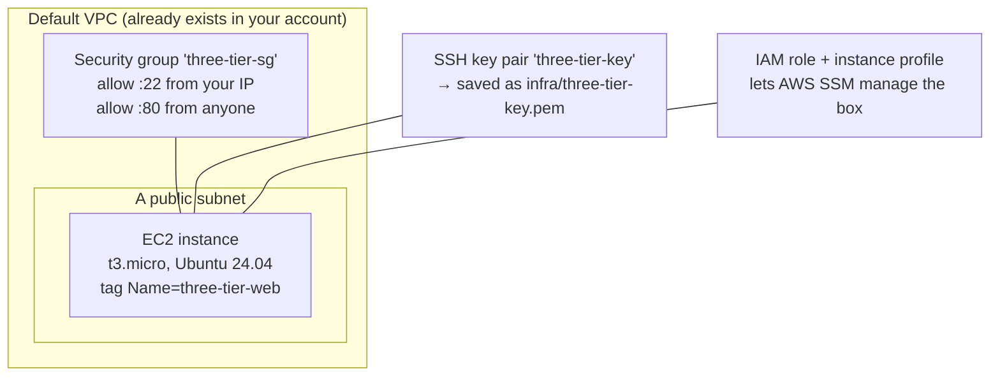

- **Security group** = a firewall on the instance. Port 22 (SSH) only from *your*
  IP; port 80 (HTTP) from the whole internet so people can visit the site.
- **Key pair** = the SSH key you'll use to log in and copy files. The private half
  is saved locally as `infra/three-tier-key.pem` — keep it secret.
- **IAM role** = lets Amazon's Systems Manager (SSM) run commands on the box. The
  CI/CD pipeline in section 9 uses this so it never needs an SSH key.

### Run it

```bash
cd three-tier-deployment
./infra/01-ec2.sh
```

Expected output (your IDs differ):

```console
==================================================================
  profile : ostad
  account : 448513989308
  region  : ap-southeast-1
==================================================================
Ubuntu 24.04 AMI : ami-0ba4172b23e57d5a8
VPC / subnet     : vpc-03aa87066fc5d088f / subnet-065f022c7585b4743
Key pair         : three-tier-key  ->  infra/three-tier-key.pem
Security group   : three-tier-sg (sg-0499f5fc690688cac)  — SSH from 45.248.151.16/32, HTTP from anywhere
IAM role         : three-tier-ssm-role (created)
Instance profile : three-tier-ssm-profile (created) — waiting 10s for it to propagate
Instance         : i-047c384a4a4d678aa (launching)
Waiting for the instance to be running and healthy…

  DONE
  INSTANCE_ID = i-047c384a4a4d678aa
  PUBLIC_IP   = 54.151.153.232
  open http://54.151.153.232/  (nothing there yet until you deploy)
```

The script writes every ID it created to `infra/.lab-state` so the other scripts
(and cleanup) can find them. **Don't delete that file** until you've cleaned up.

Visit `http://<PUBLIC_IP>/` — you'll get an Nginx error page or nothing. That's
expected: the server exists but the app isn't on it yet. That's section 6.

### Connecting to the instance (two ways)

- **Browser (easiest):** AWS Console → EC2 → your instance → **Connect** →
  *EC2 Instance Connect* → **Connect**. Opens a terminal in your browser.
- **SSH from your laptop:**
  ```bash
  ssh -i infra/three-tier-key.pem ubuntu@<PUBLIC_IP>
  ```
  If it times out, your internet IP changed since you ran the script. Re-open
  port 22 for your current IP:
  ```bash
  MYIP=$(curl -s https://checkip.amazonaws.com)
  aws ec2 authorize-security-group-ingress --profile ostad --region ap-southeast-1 \
    --group-id <SG_ID> --protocol tcp --port 22 --cidr "$MYIP/32"
  ```

**Clean up this section:** covered by [section 11](#11-cleanup) — don't do it yet.

---

## 6. Manual deploy walkthrough

**What you'll learn:** exactly what "deploying a frontend" means, by doing every
step yourself.

**You need:** section 5 done; the instance's `PUBLIC_IP`; `infra/three-tier-key.pem`.

The plan:

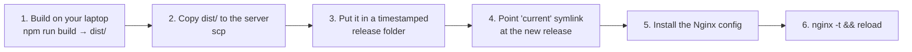

### Step 1 — build (on your laptop)

```bash
cd three-tier-deployment/frontend
BUILD_ID="manual-$(date -u +%Y%m%dT%H%M%SZ)" npm run build
cd ..
```

`BUILD_ID` gets stamped into the app so you can see which build is live (bottom of
the page, and in the JS bundle). Any string works.

### Step 2 — one-time server prep

SSH into the instance (`ssh -i infra/three-tier-key.pem ubuntu@<PUBLIC_IP>`) and
install Nginx:

```bash
sudo apt-get update -y
sudo apt-get install -y nginx
```

Expected: `nginx` installs; `systemctl is-active nginx` prints `active`.

### Step 3 — copy the build up (from your laptop)

```bash
scp -i infra/three-tier-key.pem -r frontend/dist ubuntu@<PUBLIC_IP>:/tmp/dist-upload
scp -i infra/three-tier-key.pem nginx/three-tier.conf ubuntu@<PUBLIC_IP>:/tmp/three-tier.conf
```

### Step 4 — publish it (on the server)

```bash
# a new release folder named by the current time
RELEASE="/var/www/three-tier/releases/$(date -u +%Y%m%d%H%M%S)"
sudo mkdir -p "$RELEASE"
sudo cp -r /tmp/dist-upload/. "$RELEASE/"

# 'current' is a symlink. Point it at the new release.
sudo ln -sfn "$RELEASE" /var/www/three-tier/current
ls -l /var/www/three-tier/
```

```console
current -> /var/www/three-tier/releases/20260906151121
releases
```

### Step 5 — turn on the Nginx site (on the server)

```bash
sudo cp /tmp/three-tier.conf /etc/nginx/sites-available/three-tier
sudo ln -sfn /etc/nginx/sites-available/three-tier /etc/nginx/sites-enabled/three-tier
sudo rm -f /etc/nginx/sites-enabled/default        # drop Nginx's welcome page
sudo nginx -t
sudo systemctl reload nginx
```

```console
nginx: the configuration file /etc/nginx/nginx.conf syntax is ok
nginx: configuration file /etc/nginx/nginx.conf test is successful
```

### Step 6 — verify

On the server:

```console
$ curl -s -o /dev/null -w "%{http_code}\n" http://localhost/
200
$ curl -s http://localhost/healthz
ok
$ curl -s "http://localhost/api/v1/forecast?latitude=23.81&longitude=90.41&current=temperature_2m&timezone=auto"
{"latitude":23.8,"longitude":90.4,...,"current":{"time":"...","temperature_2m":26.4}}
```

From your own machine, open `http://<PUBLIC_IP>/` in a browser. The Weather Board
loads, cities switch, and the footer shows your `manual-…` build id.

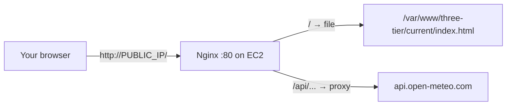

**What just happened:** a deploy is *copy files, point a symlink, reload Nginx*.
The timestamped-release + `current` symlink pattern means the switch is instant and
you can roll back by pointing the symlink at an older folder.

**If it breaks:**
- `curl /` gives 404 → `sudo nginx -t`; check `root` points at
  `/var/www/three-tier/current` and the symlink exists.
- `/api/` gives `502 Bad Gateway` → the box can't reach Open-Meteo; check
  `resolver` line and outbound internet.
- `scp` times out → your IP changed; re-authorize port 22 (see section 5).

---

## 7. Updating the app

**What you'll learn:** the redeploy loop, and why the symlink makes it safe.

Change something visible. Open [`frontend/src/App.jsx`](frontend/src/App.jsx) and
edit the subtitle:

```jsx
<p className="subtitle">A tiny frontend, deployed the DevOps way. (v2)</p>
```

Rebuild and repeat section 6 steps 1, 3, 4, 6 with a **new** `BUILD_ID`. You'll get
a *second* folder under `releases/`, and `current` now points at it:

```console
$ ls -l /var/www/three-tier/releases/
drwxr-xr-x 20260906151121
drwxr-xr-x 20260906152840      <- new
$ readlink /var/www/three-tier/current
/var/www/three-tier/releases/20260906152840
```

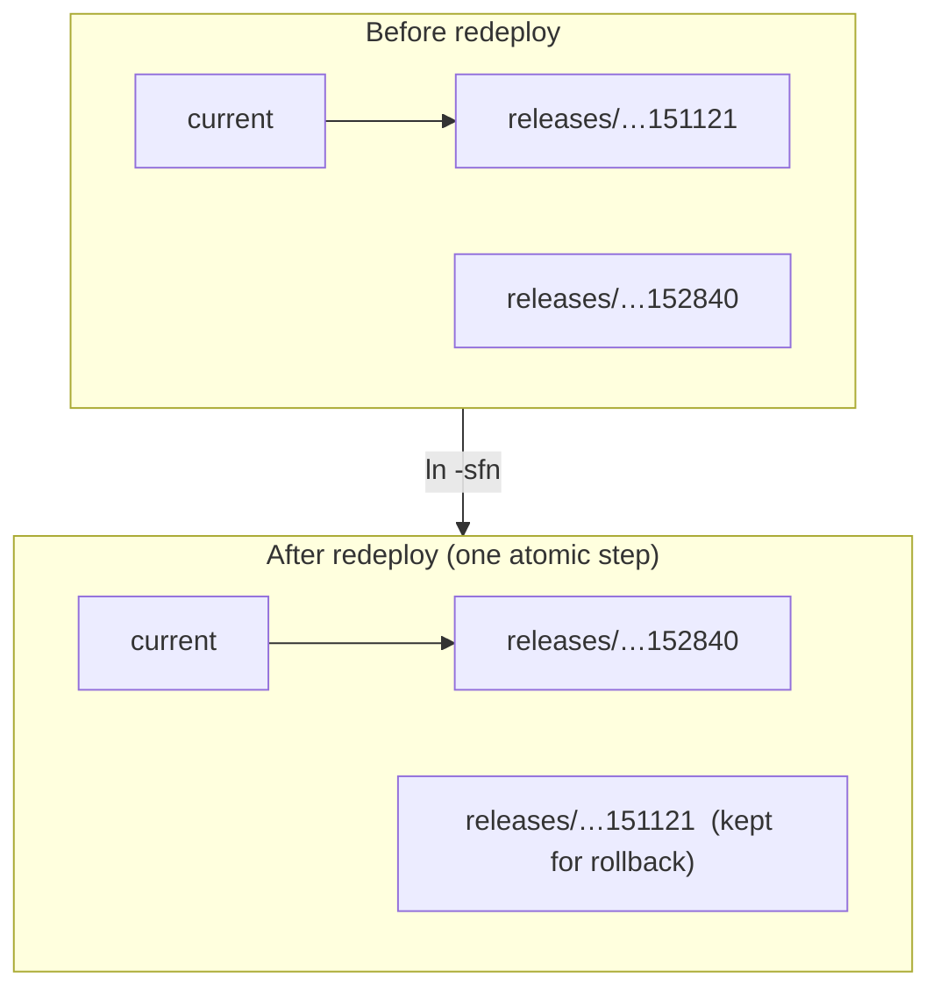

Refresh the browser — the subtitle and build id changed. No downtime: Nginx was
serving the old folder until the instant the symlink flipped.

**Rollback** is just pointing `current` back:

```bash
sudo ln -sfn /var/www/three-tier/releases/20260906151121 /var/www/three-tier/current
sudo systemctl reload nginx
```

Typing all those steps every time is tedious and error-prone. Section 8 fixes that.

---

## 8. Automate with a script

**What you'll learn:** two levels of automation — a fresh server that configures
itself, and a one-command deploy.

### 8a. A self-configuring server (`scripts/ec2-userdata.sh`)

EC2 can run a script the **first time an instance boots** ("user data"). Our
[`scripts/ec2-userdata.sh`](scripts/ec2-userdata.sh) installs Nginx + the AWS CLI,
writes the site config, and puts up a "waiting for first deploy" placeholder — so
a brand-new instance is a working web server with **zero manual steps**.

Launch a new instance that bootstraps itself:

```bash
./infra/teardown.sh          # remove the hand-built one from sections 5–7
./infra/01-ec2.sh --user-data scripts/ec2-userdata.sh
```

After it boots (~90s), visit `http://<NEW_PUBLIC_IP>/`:

```console
$ curl -s http://<NEW_PUBLIC_IP>/ | head -5
<!doctype html><meta charset="utf-8"><title>Weather Board</title>
...
  <p>Server is up. Waiting for the first deploy…</p>
$ curl -s -o /dev/null -w "%{http_code}\n" http://<NEW_PUBLIC_IP>/healthz
200
```

**What just happened:** the config work you did by hand in section 6 (steps 2 & 5)
is now baked into the instance's birth. All that's left is shipping the app.

### 8b. One-command deploy (`scripts/deploy.sh`)

[`scripts/deploy.sh`](scripts/deploy.sh) is sections 6–7 in a single command:
build → package → upload over SSH → new release folder → flip symlink → reload →
verify. It reads the instance IP and key from `infra/.lab-state`.

```console
$ ./scripts/deploy.sh
==> building frontend (BUILD_ID=8f3a1c2-20260906T153000Z)
==> packaging
==> uploading to 54.151.153.232
==> activating new release on the server
current -> /var/www/three-tier/releases/20260906153012
==> verifying over HTTP
    GET /        -> 200
    GET /api/... -> 200
    live build   -> 8f3a1c2-20260906T153000Z
==> OK  http://54.151.153.232/
```

Run it again after any code change. It keeps the last 5 releases and prunes older
ones. Override the label or retention:

```bash
BUILD_ID="hotfix-1" KEEP=10 ./scripts/deploy.sh
# or target a specific host/key:
./scripts/deploy.sh 54.151.153.232 infra/three-tier-key.pem
```

**If it breaks:**
- `npm ci` error about a locked file (Windows) → close editors, delete
  `frontend/node_modules`, retry.
- upload times out → your IP changed; re-authorize port 22 (section 5).

---

## 9. GitHub Actions CI/CD

**What you'll learn:** how to let GitHub build and deploy on every push — with **no
AWS keys stored anywhere**.

### Why not just put an AWS key in GitHub secrets?

Long-lived keys leak. Instead we use **OIDC**: GitHub proves its identity to AWS
with a short-lived token, and AWS hands back credentials that expire in an hour.
Nothing secret is ever stored in the repo.

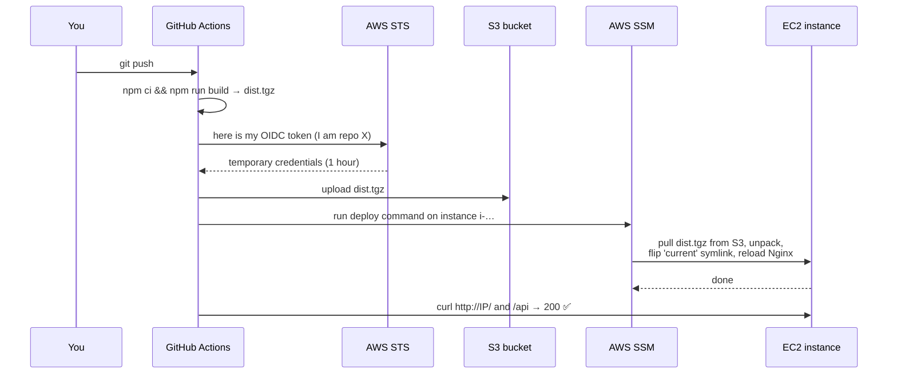

Note there's **no SSH** in that picture. GitHub talks to AWS; AWS's SSM agent —
already on the instance from section 5 — runs the commands.

### Step 1 — put this repo on your own GitHub

```bash
gh repo create three-tier-deployment --private --source . --push
```

(You can make it public later — `gh repo edit --visibility public`.)

### Step 2 — create the CI/CD infrastructure

```bash
./infra/02-cicd.sh <your-github-username>/three-tier-deployment
```

This creates:

| Resource | Purpose |
|---|---|
| S3 bucket `three-tier-deploy-<account-id>` | staging area; each build lands here as a `.tgz` (auto-deleted after 14 days) |
| GitHub **OIDC provider** | teaches your AWS account to trust GitHub's tokens (reused if you already have one) |
| IAM role `three-tier-deploy-role` | what Actions assumes: write to that bucket, send one SSM command to your instance |
| extra permission on the instance role | lets the instance *read* that bucket |

Output ends with the four values to register:

```console
  DONE. Set these as GitHub Actions *Variables* (not secrets):

    gh variable set AWS_REGION      --body "ap-southeast-1"
    gh variable set AWS_ROLE_ARN    --body "arn:aws:iam::448513989308:role/three-tier-deploy-role"
    gh variable set DEPLOY_BUCKET   --body "three-tier-deploy-448513989308"
    gh variable set EC2_INSTANCE_ID --body "i-047c384a4a4d678aa"
```

Run those four `gh variable set` lines (copy them from *your* output).

> **Built your instance by hand in section 6** (not with `--user-data`)? It has no
> AWS CLI. Install it once:
> ```bash
> aws ssm send-command --profile ostad --region ap-southeast-1 \
>   --instance-ids <INSTANCE_ID> --document-name AWS-RunShellScript \
>   --parameters 'commands=["curl -fsSL https://awscli.amazonaws.com/awscli-exe-linux-x86_64.zip -o /tmp/a.zip","unzip -q -o /tmp/a.zip -d /tmp","/tmp/aws/install --update"]'
> ```

### Step 3 — the workflow

[`.github/workflows/deploy.yml`](.github/workflows/deploy.yml) runs on every push
that touches `frontend/**`, and on demand. Its jobs, in order:

1. **Build the static site** — `npm ci`, `npm run build`, tar it up.
2. **Get temporary AWS credentials (OIDC)** — no secrets.
3. **Stage the build in S3** — `aws s3 cp dist.tgz s3://…/releases/<sha>.tgz`.
4. **Tell the instance to go live (SSM)** — one `send-command` that pulls the tgz,
   makes a release folder, flips the symlink, reloads Nginx.
5. **Verify** — `curl` the public IP for `/`, `/api`, and the exact build id.

### Step 4 — trigger it

```bash
gh workflow run deploy.yml
gh run watch
```

A successful run:

```console
✓ deploy in 40s
  ✓ Build the static site
  ✓ Get temporary AWS credentials (OIDC)
  ✓ Stage the build in S3
  ✓ Tell the instance to go live (SSM)
  ✓ Verify it is serving the new build
      GET /        -> 200
      GET /api/... -> 200
      live build -> 39ec099-20260906T153736Z  ✅
```

Now edit `frontend/src/App.jsx`, commit, push — and watch it deploy itself.

**If it breaks:**
- `Not authorized to perform sts:AssumeRoleWithWebIdentity` → the role's trust
  policy doesn't match your repo. Re-run `./infra/02-cicd.sh <user>/<repo>` with
  the exact owner/repo, wait a minute, retry.
- SSM step: `aws: not found` → the instance has no AWS CLI (see the note in step 2).
- Verify step fails → give it a few seconds and re-run; SSM is eventually consistent.

---

## 10. Full architecture view

**What you'll learn:** every component in one picture, and the command to inspect
each one while it's running.

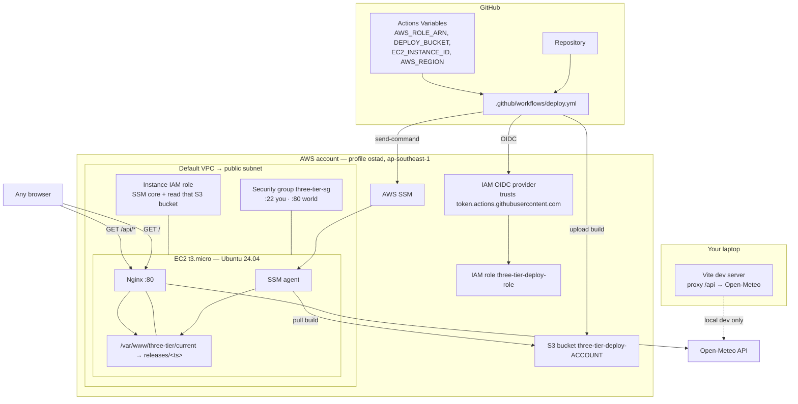

| Component | What it does | Inspect it live |
|---|---|---|
| **Vite** (`frontend/vite.config.js`) | dev server + `/api` proxy for local coding | `npm run dev` |
| **`dist/`** | the built static site — the deploy artifact | `ls frontend/dist` |
| **EC2 instance** | the Ubuntu box running Nginx | `aws ec2 describe-instances --profile ostad --instance-ids <id>` |
| **Security group** | firewall: 22 from you, 80 from all | `aws ec2 describe-security-groups --profile ostad --group-ids <sg>` |
| **Nginx** | serves files, proxies `/api`, SPA fallback | `ssh … 'sudo nginx -T'` · `curl http://<ip>/healthz` |
| **`current` symlink** | which release is live | `ssh … 'readlink -f /var/www/three-tier/current'` |
| **SSM agent** | lets AWS/CI run commands, no SSH | `aws ssm describe-instance-information --profile ostad` |
| **S3 bucket** | staging area for CI builds | `aws s3 ls s3://three-tier-deploy-<account>/releases/ --profile ostad` |
| **OIDC provider** | makes AWS trust GitHub tokens | `aws iam list-open-id-connect-providers --profile ostad` |
| **`three-tier-deploy-role`** | what GitHub Actions assumes | `aws iam get-role --role-name three-tier-deploy-role --profile ostad` |
| **GitHub Actions** | build + deploy on push | `gh run list` · `gh run watch` |
| **Open-Meteo** | the upstream weather API | `curl "https://api.open-meteo.com/v1/forecast?latitude=0&longitude=0&current=temperature_2m"` |

### See a deploy happen end to end

```bash
# 1. change something
sed -i 's/Weather Board/Weather Board ⛅/' frontend/src/App.jsx
git commit -am "tweak title" && git push

# 2. watch CI
gh run watch

# 3. confirm the box is serving the new build
IP=$(sed -n 's/^PUBLIC_IP=//p' infra/.lab-state | tail -1)
curl -s "http://$IP/$(curl -s http://$IP/ | grep -o 'assets/index-[^\"]*\.js')" | grep -o 'Weather Board ⛅'
```

---

## 11. Cleanup

**Run this every time you're done.** It deletes everything the lab created.

```bash
./scripts/cleanup.sh
```

Expected:

```console
Terminating instances…
  - instance i-047c384a4a4d678aa
Deleting CI/CD resources…
  - s3://three-tier-deploy-448513989308
  - role three-tier-deploy-role
  - OIDC provider (created by this lab)
Deleting instance resources…
  - instance profile three-tier-ssm-profile
  - role three-tier-ssm-role
  - security group sg-0499f5fc690688cac
  - key pair three-tier-key
  - local infra/three-tier-key.pem
Done. infra/.lab-state removed.
```

> The GitHub **OIDC provider** is deleted **only if this lab created it**. If your
> account already had one (other projects use it), it's left alone.

### Verify nothing is left

```bash
P="--profile ostad --region ap-southeast-1"
aws ec2 describe-instances $P \
  --filters Name=tag:Name,Values=three-tier-web Name=instance-state-name,Values=running,pending \
  --query 'Reservations[].Instances[].InstanceId'          # []
aws ec2 describe-security-groups $P --filters Name=group-name,Values=three-tier-sg \
  --query 'SecurityGroups[].GroupId'                        # []
aws s3 ls $P | grep three-tier-deploy || echo "no bucket"   # no bucket
aws iam get-role --role-name three-tier-deploy-role $P 2>&1 | grep -o 'NoSuchEntity'   # NoSuchEntity
```

All four should come back empty / `NoSuchEntity`. If the security-group delete
complained (it can, right after the instance terminates), wait a minute and run
`./scripts/cleanup.sh` again — it's safe to repeat.

### Cost check

With everything torn down, your only possible charge is a few cents of EC2/EBS
time while the lab ran. Confirm in the AWS Console → **Billing → Bills**.

---

## 12. Full three-tier architecture

**What you'll learn:** how the same app looks once it has a real backend and a
real database, and why putting all three tiers on **one VM** is a legitimate,
much simpler choice for a class like this.

Part 1's Nginx proxied `/api/*` straight to Open-Meteo. Part 2 puts **your own
backend** in between: the browser still only ever talks to Nginx, but now Nginx
hands `/api/*` to a Node/Express service, which calls Open-Meteo itself and
remembers every search in Postgres.

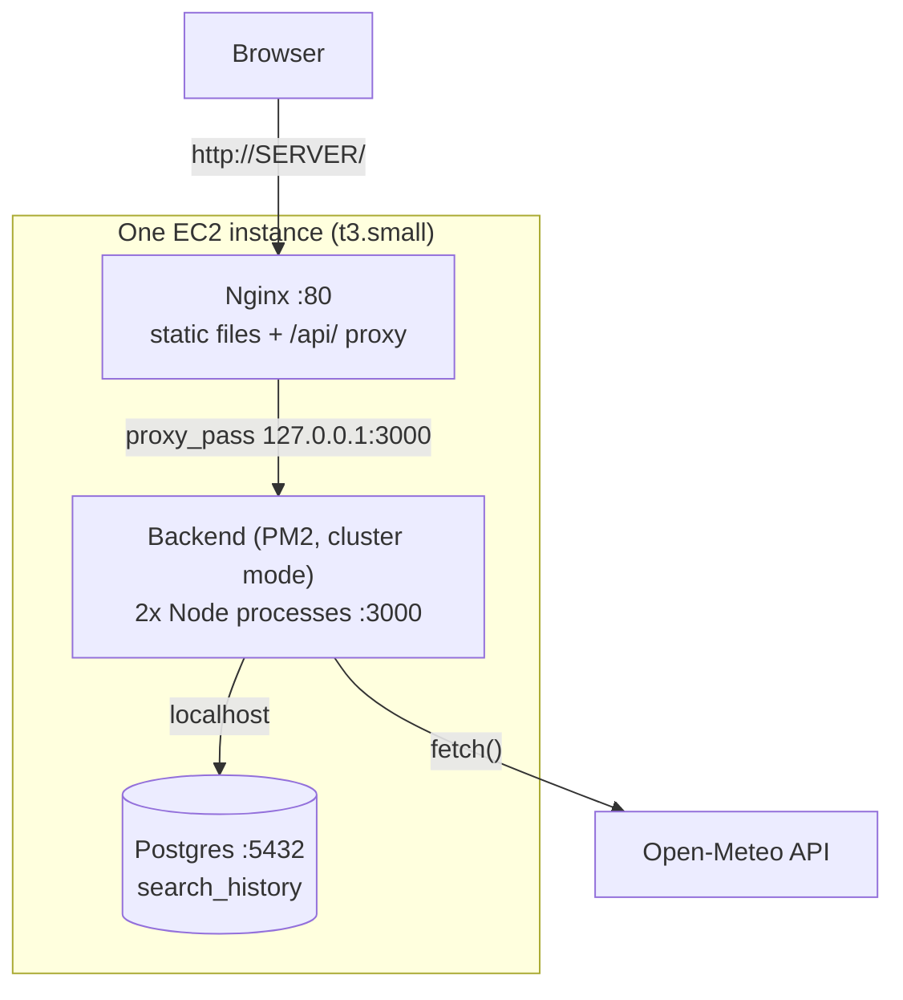

Why one VM, honestly:
- **Nothing new to expose.** Backend (3000) and Postgres (5432) bind to
  `127.0.0.1` only — they never touch the security group. The SG is *exactly*
  Part 1's: 22 from you, 80 from the world. Three tiers, same firewall surface
  as one.
- **No private-IP plumbing.** A multi-instance layout needs each tier to know
  the others' private IPs, chained security groups, and Nginx configs templated
  per-environment. On one box, `/api/` just proxies to `localhost:3000` —
  always, everywhere, no templating.
- **The same provisioning script.** `infra/01-ec2.sh --instance-type t3.small`
  — the only thing that changed from Part 1 is the instance size (Postgres
  needs headroom `t3.micro`'s 1GB doesn't comfortably have).

This is a deliberate simplification for teaching, not a security shortcut —
say so plainly if a student asks "isn't putting the database on the web server
bad practice?" (Answer: in a real deployment you'd split tiers for
independent scaling and blast-radius reasons, not because co-locating them is
inherently insecure — the co-located version here still never exposes the
backend or database to the network.)

---

## 13. The backend tier

**What you'll learn:** what the one file that talks to both Open-Meteo and
Postgres actually does, and why a failed "nice to have" must never break the
main feature.

Read [`backend/src/server.js`](backend/src/server.js) — three routes:

| Route | Does |
|---|---|
| `GET /health` | `{"status":"ok"}` — for anything checking "is the process up" |
| `GET /api/v1/forecast` | calls Open-Meteo itself (the browser never does), returns the weather, and **tries** to log the query to Postgres |
| `GET /api/v1/history` | the last 10 logged queries |

The important design choice is in `/api/v1/forecast`:

```js
if (upstream.ok) {
  pool.query(`INSERT INTO search_history ...`, [...])
    .catch((err) => console.error('history insert failed (non-fatal):', err.message));
}
res.status(upstream.status).json(data); // the weather is returned regardless
```

The `pool.query(...).catch(...)` is deliberately **not** `await`ed with a
`try/catch` that could reach the response — a broken database must never turn
a working weather lookup into a 500. This is the same instinct behind the
frontend's `RecentSearches` component hiding itself instead of showing an
error (§ frontend architecture) — a secondary feature failing should never be
visible as a primary failure.

**A bug worth knowing about** (found live while building this lab):
[`backend/ecosystem.config.cjs`](backend/ecosystem.config.cjs) starts the app
under PM2, but **PM2 does not read `.env` files** — only Node does, and only if
told to. Without loading it, `DATABASE_URL` is silently `undefined` and every
Postgres call fails with `SASL: client password must be a string`. The fix is
one line at the top of `server.js`:

```js
import 'dotenv/config'; // loads .env into process.env — PM2 does not do this itself
```

If you ever see that exact SASL error with a working `.env` file on disk, this
is almost always why — check the app is actually loading it.

---

## 14. The database tier

**What you'll learn:** the one table this app needs, and how to look at it
directly.

[`database/migrations/001_create_search_history.sql`](database/migrations/001_create_search_history.sql):

```sql
CREATE TABLE IF NOT EXISTS search_history (
    id          SERIAL PRIMARY KEY,
    city        TEXT,
    latitude    NUMERIC(9, 5) NOT NULL,
    longitude   NUMERIC(9, 5) NOT NULL,
    temperature NUMERIC(5, 2),
    queried_at  TIMESTAMPTZ NOT NULL DEFAULT now()
);
```

`IF NOT EXISTS` is what makes re-running the migration safe — every deploy
(manual, scripted, or CI) re-applies it, and it's a no-op once the table
exists. Real projects use a proper migration tool (Flyway, node-pg-migrate,
Prisma Migrate) so schema changes are tracked and reversible one at a time;
one file is enough for this class.

Look at the data directly:

```console
$ sudo -u postgres psql -d three_tier -c '\dt'
             List of relations
 Schema |      Name      | Type  |  Owner
--------+----------------+-------+----------
 public | search_history | table | postgres

$ sudo -u postgres psql -d three_tier -c 'SELECT city, temperature, queried_at FROM search_history ORDER BY queried_at DESC LIMIT 5;'
   city    | temperature |          queried_at
-----------+-------------+-------------------------------
 London    |       20.20 | 2026-09-13 14:35:03.839+00
 Singapore |       26.70 | 2026-09-13 14:34:34.215+00
```

---

## 15. Deploying the full stack on your VM

**What you'll learn:** bringing up all three tiers on one instance, and proving
they actually talk to each other.

**You need:** the `ostad` profile; nothing from Part 1 still running (or use a
fresh instance — either is fine, they don't collide).

### Provision a bigger box

```bash
./infra/01-ec2.sh --instance-type t3.small
```

Same script as Part 1's §5 — just a bigger instance type. Note the
`PUBLIC_IP` it prints; you'll use it below.

### Install once: Nginx, Postgres, Node, PM2

```bash
ssh -i infra/three-tier-key.pem ubuntu@<PUBLIC_IP>
sudo apt-get update -y
sudo apt-get install -y nginx postgresql
curl -fsSL https://deb.nodesource.com/setup_22.x | sudo -E bash -
sudo apt-get install -y nodejs
sudo npm install -g pm2
```

### Bring up each tier

From your laptop:

```bash
scripts/deploy-db.sh          # installs the schema, prints a generated DB password
scripts/deploy-backend.sh     # ships backend/, starts it under PM2 (cluster, 2 workers)
scripts/deploy.sh             # ships the frontend build (same script Part 1 used)
```

One more one-time step on the server — the Part 2 Nginx config (proxies to
your backend, not Open-Meteo):

```bash
scp -i infra/three-tier-key.pem nginx/three-tier-full.conf ubuntu@<PUBLIC_IP>:/tmp/three-tier.conf
ssh -i infra/three-tier-key.pem ubuntu@<PUBLIC_IP> '
  sudo cp /tmp/three-tier.conf /etc/nginx/sites-available/three-tier
  sudo ln -sfn /etc/nginx/sites-available/three-tier /etc/nginx/sites-enabled/three-tier
  sudo rm -f /etc/nginx/sites-enabled/default
  sudo nginx -t && sudo systemctl reload nginx
'
```

### Verify — the whole loop, end to end

```console
$ curl -s http://<PUBLIC_IP>/healthz
ok
$ curl -s "http://<PUBLIC_IP>/api/v1/forecast?latitude=51.5&longitude=-0.13&city=London&current=temperature_2m&timezone=auto"
{"latitude":51.49,...,"current":{"temperature_2m":20.2,...}}
$ curl -s http://<PUBLIC_IP>/api/v1/history
{"rows":[{"city":"London","latitude":"51.50000","longitude":"-0.13000","temperature":"20.20","queried_at":"2026-09-13T14:35:03.839Z"}]}
```

Open `http://<PUBLIC_IP>/` in a browser: pick a city, and the **Recent
searches** panel below the forecast fills in with real rows from Postgres —
proof the request travelled browser → Nginx → backend → Postgres and back.

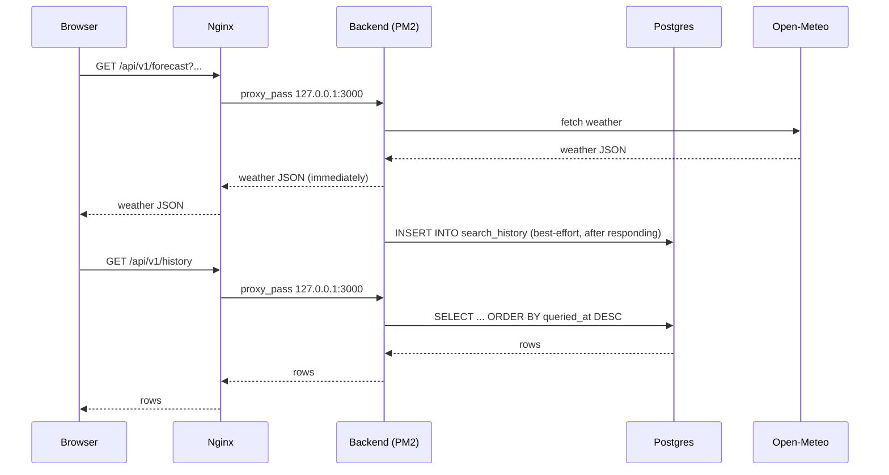

**If it breaks:**
- `/api/v1/history` returns 500 with a SASL/password error → see the `.env`
  loading bug in §13 — confirm `backend/src/server.js` has
  `import 'dotenv/config'` at the top and you're running the current code.
- `/api/v1/forecast` works but history stays empty → check
  `sudo -u ubuntu -H pm2 logs backend` for the (non-fatal, logged) insert
  error — usually a stale `DATABASE_URL` password after re-running
  `scripts/deploy-db.sh` (it regenerates the password only if none exists yet;
  re-run `scripts/deploy-backend.sh` after to pick up the current one).

---

## 16. Configuring AWS SSM

**What you'll learn:** exactly what "the pipeline can run commands on your
server without SSH" requires — spelled out, not treated as magic. This is a
**one-time setup step you do yourself**, before any GitHub workflow exists.
Read this once; both automation options (§17, §18) depend on it.

### What it's for here

Three things in this repo run commands on the instance with **no open SSH
port and no distributed key**: the manual "just run this on the box" moments
in §15 could always be SSH — but `scripts/deploy-db.sh` shows you can prefer
SSM instead, and the OIDC/CI path in §17 has *no other way in*. SSM is what
makes that possible.

### The three ingredients

1. **The SSM Agent**, running on the instance. Ubuntu's official AMI ships it
   pre-installed — you don't do anything for this one. Verify:
   ```console
   $ ssh ... 'systemctl is-active amazon-ssm-agent || systemctl is-active snap.amazon-ssm-agent.amazon-ssm-agent'
   active
   ```
2. **An IAM role + instance profile**, attached to the instance at launch,
   granting the agent permission to talk to the SSM service. This is created
   by `infra/01-ec2.sh` — here is the exact code (nothing hidden):
   ```bash
   aws iam create-role --role-name three-tier-ssm-role \
     --assume-role-policy-document '{"Version":"2012-10-17","Statement":[
       {"Effect":"Allow","Principal":{"Service":"ec2.amazonaws.com"},"Action":"sts:AssumeRole"}
     ]}'
   aws iam attach-role-policy --role-name three-tier-ssm-role \
     --policy-arn arn:aws:iam::aws:policy/AmazonSSMManagedInstanceCore
   aws iam create-instance-profile --instance-profile-name three-tier-ssm-profile
   aws iam add-role-to-instance-profile \
     --instance-profile-name three-tier-ssm-profile --role-name three-tier-ssm-role
   ```
   Then the instance is launched with `--iam-instance-profile Name=three-tier-ssm-profile`.
3. **Outbound network access** to AWS's SSM endpoints — already true of every
   instance this repo launches (public subnet + internet gateway).

### Verify the instance registered

```console
$ aws ssm describe-instance-information --profile ostad \
    --filters "Key=InstanceIds,Values=i-0bc26c37b7fc66706" \
    --query 'InstanceInformationList[0].PingStatus' --output text
Online
```

`Online` means all three ingredients are in place. If it says nothing or
times out, the instance profile likely didn't attach in time — wait ~30s
after launch and retry (`infra/01-ec2.sh` already builds this wait in).

### Why this matters for "IAM config outside CI/CD"

`infra/01-ec2.sh` and `infra/02-cicd.sh` (§17 sets it up) are scripts **you
run from your own machine, once**. Neither GitHub workflow in this repo
creates, modifies, or even has permission to touch IAM — grep them and see for
yourself, there is no `iam:Create*`/`iam:Attach*` anywhere in
`.github/workflows/`. A workflow only ever **assumes** an already-existing
role and **sends** an SSM command to an already-registered instance. If that
role or registration doesn't exist yet, the workflow fails clearly — it never
silently creates one.

---

## 17. Automating — Option A: GitHub-hosted runner + OIDC + SSM

**What you'll learn:** letting GitHub's own runner deploy your full stack,
never storing an AWS key anywhere.

This reuses the *exact same* `infra/02-cicd.sh` from Part 1 — S3 bucket, GitHub
OIDC provider, IAM role — nothing Part-2-specific to create. Re-run it (safe,
idempotent) so the role's SSM permission still points at whichever instance
you have running now:

```bash
./infra/02-cicd.sh <your-github-username>/three-tier-deployment
```

Set the four repo variables it prints (`AWS_REGION`, `AWS_ROLE_ARN`,
`DEPLOY_BUCKET`, `EC2_INSTANCE_ID`) exactly as in Part 1 §9.

[`.github/workflows/full-stack-oidc-ssm.yml`](.github/workflows/full-stack-oidc-ssm.yml)
job by job:

```mermaid
sequenceDiagram
    participant GH as GitHub Actions (ubuntu-latest)
    participant AWS as AWS STS
    participant S3 as S3 bucket
    participant SSM as AWS SSM
    participant EC2 as Your instance
    GH->>GH: npm ci && build frontend; tar backend/
    GH->>AWS: OIDC token -> temporary credentials
    GH->>S3: upload frontend.tgz, backend.tgz, migration.sql
    GH->>SSM: send-command (apply migration, pm2 startOrReload, swap symlink)
    SSM->>EC2: runs it
    EC2-->>SSM: done
    GH->>EC2: curl / , /api/v1/forecast, /api/v1/history -> 200
```

One extra thing this workflow does that's worth pointing out: **it proves
zero-downtime**, not just claims it. Before sending the deploy command, it
starts a background loop hitting `/api/v1/history` every 0.2s; after the
deploy, it fails the job if **any** of those requests weren't `200`.

Trigger it and watch:

```console
$ gh workflow run full-stack-oidc-ssm.yml
$ gh run watch

✓ deploy in 44s
  ✓ Build the frontend
  ✓ Package the backend
  ✓ Get temporary AWS credentials (OIDC)
  ✓ Stage both artifacts in S3
  ✓ Deploy all three tiers on the instance (one SSM command)
  ✓ Check the zero-downtime watch log
        --- response codes seen for /api/v1/history during the deploy ---
             26 200
        all requests were 200 — zero-downtime confirmed
  ✓ Verify the live site
        GET /                 -> 200
        GET /api/v1/forecast   -> 200
        GET /api/v1/history    -> 200
        live build -> fb5d8b3-20260913T143527Z ✅
```

**No AWS credential of any kind lives in this repo or in GitHub secrets** —
only the four *non-secret* repo Variables above, which are just IDs, not
credentials.

---

## 18. Automating — Option B: a self-hosted runner

**What you'll learn:** the other way to automate — put the runner *inside* the
environment it deploys to, so the deploy step needs no cloud credentials at
all.

> **Lab simplification, stated plainly:** this puts the runner on the *same*
> VM as the app, purely to avoid paying for a second instance in a classroom.
> In a real team, a self-hosted runner is normally a separate, disposable
> machine — never the production box it deploys to.

### Install and register (one-time, outside any pipeline)

```bash
./infra/21-self-hosted-runner.sh <your-github-username>/three-tier-deployment
```

This fetches a short-lived registration token with `gh` (never stored),
installs the GitHub Actions runner on your instance via SSM, and starts it as
a systemd service. Verify:

```console
$ gh api repos/<user>/three-tier-deployment/actions/runners \
    --jq '.runners[] | {name,status,busy,labels:[.labels[].name]}'
{"busy":false,"labels":["self-hosted","Linux","X64","three-tier-lab"],"name":"three-tier-runner","status":"online"}
```

### The workflow

[`.github/workflows/full-stack-self-hosted.yml`](.github/workflows/full-stack-self-hosted.yml)
targets `runs-on: [self-hosted, three-tier-lab]`. Compare it line by line with
Option A's workflow — **every AWS/OIDC step is simply gone**. Building and
deploying the frontend is `npm run build` followed by a plain local `cp` (no
upload — it's already the right machine); the backend and database steps are
local `rsync`/`psql`/`pm2` calls instead of an SSM command.

```console
$ gh workflow run full-stack-self-hosted.yml
$ gh run watch

✓ deploy in 42s
  ✓ Build the frontend (locally — no upload needed, same machine)
  ✓ Apply the database migration
  ✓ Deploy the backend (PM2 rolling reload)
  ✓ Deploy the frontend (atomic symlink swap)
  ✓ Check the zero-downtime watch log
        all requests were 200 — zero-downtime confirmed
  ✓ Verify (locally, on the box)
        live build -> fb5d8b3-20260913T143909Z-selfhosted ✅
```

Confirm which runner actually ran it (not GitHub's shared pool):

```console
$ gh api repos/<user>/three-tier-deployment/actions/runs/<run-id>/jobs --jq '.jobs[].runner_name'
three-tier-runner
```

---

## 19. Option A vs Option B

| | **A: GitHub-hosted + OIDC/SSM** | **B: Self-hosted runner** |
|---|---|---|
| Where the runner lives | GitHub's cloud, ephemeral | Your own machine, always on |
| Credentials the deploy step needs | none stored — a 1-hour OIDC token | none at all — it's already inside |
| How commands reach the server | AWS SSM (no open SSH) | local shell (same box) |
| Cost while idle | $0 (free minutes) | you pay for the runner's host 24/7 |
| Setup complexity | IAM role + OIDC provider (once) | install + register a runner (once); **you** patch/secure that machine |
| Network exposure needed | none beyond what the app itself needs | none, if co-located like this lab |
| Good fit when | standard case — ephemeral, low-maintenance | you need access to private/internal resources a cloud runner can't reach, custom hardware, or very long builds |

Neither is "the automated way" — they're two answers to "where does the thing
that deploys my app run?", and real teams pick based on network topology and
who's willing to own patching a machine.

---

## 20. Full picture — everything, both paths

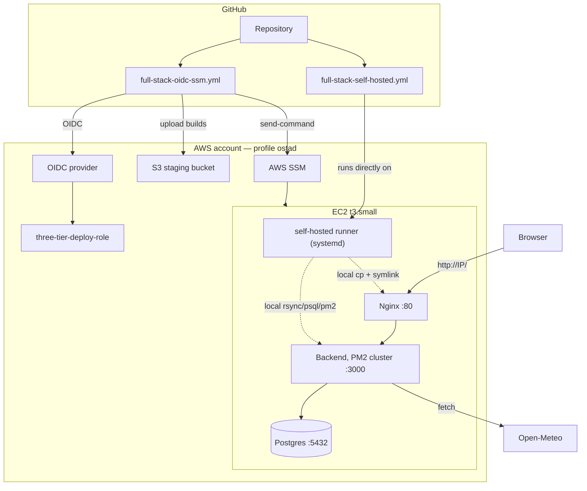

| Component | Job | Inspect it |
|---|---|---|
| Nginx | static files + `/api/` proxy + SPA fallback | `sudo nginx -T`, `curl /healthz` |
| Backend (PM2, cluster) | Tier 2 — calls Open-Meteo, writes/reads Postgres | `pm2 list`, `pm2 logs backend` |
| Postgres | Tier 3 — `search_history` | `sudo -u postgres psql -d three_tier -c '\dt'` |
| SSM Agent + role | lets AWS (and Option A's workflow) run commands, no SSH | `aws ssm describe-instance-information` |
| S3 bucket | staging area for Option A's builds | `aws s3 ls s3://three-tier-deploy-<account>/` |
| OIDC provider + role | what Option A's workflow assumes, no stored keys | `aws iam get-role --role-name three-tier-deploy-role` |
| Self-hosted runner | Option B — runs GitHub Actions jobs locally | `gh api repos/<user>/<repo>/actions/runners` |

---

## 21. Cleanup (Part 2)

**Run this when you're done with Part 2.** It removes everything, including
the self-hosted runner:

```bash
scripts/cleanup.sh
```

```console
  - self-hosted runner deregistered from <user>/three-tier-deployment
Terminating instances…
  - instance i-0bc26c37b7fc66706
Deleting CI/CD resources…
  - s3://three-tier-deploy-<account>
  - role three-tier-deploy-role
  - OIDC provider (created by this lab)
Deleting instance resources…
  - instance profile three-tier-ssm-profile
  - role three-tier-ssm-role
  - security group sg-...
  - key pair three-tier-key
Done. infra/.lab-state removed.
```

The runner is deregistered from GitHub **before** the instance is terminated,
so it never lingers as a dead "offline" entry in your repo's runner list.

Verify (same pattern as Part 1 §11):

```bash
P="--profile ostad --region ap-southeast-1"
aws ec2 describe-instances $P --filters Name=tag:Name,Values=three-tier-web \
  Name=instance-state-name,Values=running,pending --query 'Reservations[].Instances[].InstanceId'   # []
aws s3 ls $P | grep three-tier                                                                       # (nothing)
aws iam get-role --role-name three-tier-deploy-role $P 2>&1 | grep -o NoSuchEntity                   # NoSuchEntity
gh api repos/<user>/three-tier-deployment/actions/runners --jq '.runners'                             # []
```

---

## 22. Why Monitoring Matters

**What you'll learn:** the case for monitoring, before any tool.

Picture this: your app goes down at 2am. Nobody is watching a terminal. The first
person to notice is a user, hours later, who can't check the weather and quietly
gives up. By the time someone investigates, the trail is cold — was it the
database? The backend? Did the disk fill up? Without monitoring, every incident
starts with "I have no idea."

Monitoring answers three questions, continuously, without a human watching:
1. **Is it up?** (the host, each tier, the app as a whole)
2. **Is it healthy?** (not just "responding," but responding *fast enough*,
   *without errors*, *with resources to spare*)
3. **What just changed?** (so when #1 or #2 goes bad, you have a timeline)

This class covers two complementary tools: **Prometheus** collects and stores
numbers over time (*metrics*) and can tell someone when a number crosses a
line (*alerting*, §37); **Grafana** (Part 4) turns those numbers into pictures
a human can actually read at a glance. A third signal — **logs**, the detailed
"what happened" a metric can't capture — joins the stack in §36.

Four tiers, four different things worth watching:

| Tier | "Is it healthy?" looks like |
|---|---|
| Host (the VM itself) | CPU, memory, disk not maxed out |
| Frontend (Nginx) | serving requests, not erroring |
| Backend (the API) | fast, low error rate, actually reachable |
| Database (Postgres) | accepting connections, not overloaded |

---

## 23. Introduction to Prometheus

**What you'll learn:** the pull model, what a "target" and a "time series"
are — the two ideas everything else in this class builds on.

Prometheus is a **pull-based** monitoring system: instead of your app pushing
data somewhere, Prometheus reaches *out* to a list of addresses on a timer and
asks each one "what are your numbers right now?" Each address is a **target**;
what it exposes is a plain HTTP page of numbers called `/metrics`. A program
that turns "some system's internal state" into that plain-text page is called
an **exporter** — Node Exporter (§26) turns Linux's own `/proc` filesystem
into a `/metrics` page, for instance.

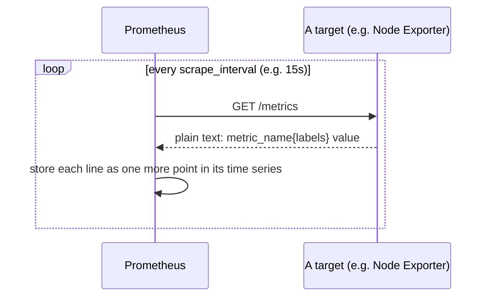

Why pull instead of push? Prometheus alone decides *when* to ask (so one slow
target can't flood it), targets don't need to know anything about where data
goes (a target that comes up serves the same `/metrics` whether anyone's
scraping it or not), and — the part that matters most for this class — **if
Prometheus can't reach a target, that absence is itself the signal** ("this
thing stopped answering" is exactly what the `up` metric and the
`InstanceDown` alert in §37 are built on).

Every number Prometheus stores is a **time series**: a metric name, a set of
key/value **labels** that distinguish one instance of it from another (e.g.
`http_requests_total{method="GET",route="/health"}` is a different series
from the same metric with `route="/api/v1/history"`), and a value at a point
in time. Prometheus's own database (a **TSDB**, time-series database) is built
to store an enormous number of these efficiently and query across time.

---

## 24. Setting Up Prometheus

**What you'll learn:** the anatomy of `prometheus.yml` — read it before you
run it.

Open [`monitoring/prometheus.yml`](monitoring/prometheus.yml). Four sections:

```yaml
global:
  scrape_interval: 15s      # how often, by default, to poll every target
  evaluation_interval: 15s  # how often to re-check the alert rules

rule_files:
  - "alert-rules.yml"       # where the alert conditions live (§37)

alerting:
  alertmanagers:
    - static_configs: [{ targets: ["localhost:9093"] }]   # where to send a firing alert

scrape_configs:              # the actual list of targets — one job per "kind" of thing
  - job_name: "node"
    static_configs: [{ targets: ["localhost:9100"] }]
  # ...
```

A `job_name` groups related targets under one label (`job="node"`,
`job="backend"`, etc.) — every PromQL query in §28 filters or groups by `job`.

---

## 25. Hands-on: Install Prometheus on EC2

**What you'll learn:** getting Prometheus running for real, and why its port
is restricted to your IP.

**You need:** the instance from Part 2 (or a fresh one — §15), bumped to
`t3.medium` this time — Postgres + a 2-worker Node cluster + Prometheus +
Grafana + three exporters is real memory pressure that `t3.small`'s 2GB
doesn't comfortably have.

```bash
./infra/01-ec2.sh --instance-type t3.medium
./infra/30-monitoring-sg.sh
```

`30-monitoring-sg.sh` opens three ports on the **same** security group Part 1
already created — no new SG, nothing new to clean up separately:

```console
$ ./infra/30-monitoring-sg.sh
  + port 9090 from <your-ip>/32 (prometheus-ui-my-ip)
  + port 9093 from <your-ip>/32 (alertmanager-ui-my-ip)
  + port 3001 from 0.0.0.0/0 (grafana-public)
```

**Why Prometheus and Alertmanager stay IP-restricted but Grafana doesn't:**
Prometheus and Alertmanager ship with **no authentication at all** — anyone
who can reach port 9090 can read every metric this app has ever produced, and
anyone reaching 9093 can silence your alerts. Grafana has a real login
(forced password change on first use, §30), so opening it to the world is a
normal — if still slightly bold for a permanent server — choice; doing the
same for Prometheus would not be.

Then install:

```bash
scripts/deploy-monitoring.sh
```

This installs seven services; §25/§31 only cover the two this chapter cares
about. Once it finishes, open `http://<PUBLIC_IP>:9090` in a browser — the
Prometheus UI. Click **Status → Targets**. The `prometheus` job (Prometheus
scraping itself) should show **UP** — the simplest possible thing to check
first, and proof the service is alive before you add anything else.

**If it breaks:** browser times out → re-check `./infra/30-monitoring-sg.sh`
ran and your IP hasn't changed since (same caveat as SSH in Part 1 §5).

---

## 26. Node Exporter Deep Dive

**What you'll learn:** what Node Exporter actually collects, before treating
it as a black box.

Node Exporter reads Linux's own bookkeeping — `/proc`, `/sys` — and republishes
it as Prometheus metrics. A few families that matter most:

| Metric | What it is |
|---|---|
| `node_cpu_seconds_total{mode="idle"\|"user"\|"system"...}` | cumulative CPU time by mode — a **counter**, always increasing |
| `node_memory_MemTotal_bytes` / `node_memory_MemAvailable_bytes` | total vs. actually-available RAM |
| `node_filesystem_size_bytes` / `node_filesystem_avail_bytes` | per-mountpoint disk size vs. free |
| `node_load1` / `node_load5` / `node_load15` | classic Unix load averages |

Notice `node_cpu_seconds_total` is a **counter** (only goes up — total seconds
spent, ever) not a percentage. There is no `node_cpu_percent` metric to graph
directly; §28 shows why, and how `rate()` turns a counter into the percentage
you actually want.

`scripts/deploy-monitoring.sh` installed it as a systemd service bound to
`127.0.0.1:9100` — never touches the security group (§12's pattern). Look at
the raw page it exposes:

```console
$ curl -s http://localhost:9100/metrics | grep node_load1
node_load1 0.08
```

---

## 27. Configure Prometheus to Scrape Node Exporter

**What you'll learn:** the one line that turns "a program exposing metrics"
into "something Prometheus actually watches" — and how to prove it worked.

Node Exporter running is not enough on its own; Prometheus has to be *told*
about it. That's the `job_name: "node"` entry already in
[`monitoring/prometheus.yml`](monitoring/prometheus.yml):

```yaml
  - job_name: "node"
    static_configs:
      - targets: ["localhost:9100"]
```

After editing a config, Prometheus needs to reload it — either a full
restart, or (since it was started with `--web.enable-lifecycle`) a live
reload with no downtime:

```bash
curl -X POST http://localhost:9090/-/reload
```

Verify on the **Status → Targets** page: the `node` job should show **UP**,
with a "Last Scrape" time that keeps moving forward every 15s. This is the
whole loop from §23 made concrete: Prometheus asked, Node Exporter answered,
and now there's a growing time series for every metric in §26.

---

## 28. PromQL

**What you'll learn:** enough PromQL to ask real questions of real data —
`rate()`, aggregation, and `histogram_quantile()`.

Prometheus's UI has a **Graph** tab — open it, and try each query below
against your own running Node Exporter.

**A raw counter is almost never what you want to graph.** `node_cpu_seconds_total`
only ever goes up; graphed directly it's just a line climbing forever. What
you actually want is *how fast* it's climbing — that's `rate()`:

```promql
rate(node_cpu_seconds_total{mode="idle"}[5m])
```

This means "the per-second average rate of increase, over the last 5
minutes" — for CPU idle time, that's the fraction of a second per second the
CPU spent idle, i.e. how NOT-busy it's been. Flip it into "how busy":

```promql
100 - (avg(rate(node_cpu_seconds_total{mode="idle"}[5m])) * 100)
```

`avg(...)` here is an **aggregation** — it collapses multiple time series
(one per CPU core) into one number. Aggregations can group by a label instead
of collapsing everything, with `by (...)`:

```promql
sum by (route) (rate(http_requests_total{job="backend"}[5m]))
```

"Request rate, broken down per API route" — one line per distinct `route`
label value, instead of one grand total.

Finally, **percentiles from a histogram**. `http_request_duration_seconds`
(§13) is a Histogram, not a single number — it counts how many requests fell
into each duration "bucket." `histogram_quantile()` turns those buckets into
an estimated percentile:

```promql
histogram_quantile(0.95, sum by (le, route) (rate(http_request_duration_seconds_bucket{job="backend"}[5m])))
```

"The 95th-percentile latency, per route" — the number below which 95% of
requests finished. This is the query behind the p95 panel in §35.

Three queries to actually run against your own instance right now:

```promql
100 - (avg(rate(node_cpu_seconds_total{mode="idle"}[5m])) * 100)                                      -- CPU busy %
(1 - (node_memory_MemAvailable_bytes / node_memory_MemTotal_bytes)) * 100                              -- memory used %
(1 - (node_filesystem_avail_bytes{mountpoint="/"} / node_filesystem_size_bytes{mountpoint="/"})) * 100 -- disk used %
```

---

## 29. Introduction to Grafana

**What you'll learn:** what Grafana adds on top of what you already have.

Prometheus's own UI (the Graph tab you just used) is genuinely useful for
one-off questions, but it isn't built to be *lived in*: no saved layouts, no
mixing data from more than one source on one screen, no alerting UI beyond
the raw rule list, nothing built for a wall-mounted "here's the state of
everything" view. Grafana is a separate, general-purpose visualization
layer that reads from Prometheus (and Loki, and many other systems) instead
of replacing it — Prometheus decides what's true, Grafana decides how it looks.

---

## 30. Setting Up Grafana

**What you'll learn:** the install, and a genuine gotcha this repo already
walked into once.

**The port collision:** Grafana's default port is **3000** — which, on this
exact VM, is already the backend's internal port (§13, `PORT=3000` in its
`.env`). Running both on 3000 would mean whichever started last wins and the
other silently fails to bind. `scripts/deploy-monitoring.sh` sets
`http_port = 3001` in `/etc/grafana/grafana.ini` before starting it. Two
services on one box quietly wanting the same port is a completely normal
real-world surprise — better to hit it once here than in front of a class.

First login is `admin` / `admin` — Grafana forces a password change
immediately. Since §17's security group answer opened Grafana to the whole
internet, **do this before anyone else finds the login page.**

---

## 31. Hands-on: Deploy Grafana on EC2

**What you'll learn:** confirming it's actually reachable, from outside.

Grafana was already installed by the same `scripts/deploy-monitoring.sh` run
in §25 (one script, seven services — see §25's note). Confirm it's live:

```console
$ curl -s -o /dev/null -w "%{http_code}\n" http://<PUBLIC_IP>:3001/login
200
```

Open `http://<PUBLIC_IP>:3001/` in a browser and log in.

---

## 32. Add Prometheus Data Source

**What you'll learn:** wiring Grafana to Prometheus, by hand once, then seeing
the "automate it" version.

In Grafana: **Connections → Data sources → Add data source → Prometheus**.
URL: `http://localhost:9090` (Grafana and Prometheus are on the same box —
this is the same "reach it over localhost" pattern as everything in §12).
**Save & test** should report success.

That manual click-through is exactly what
[`monitoring/datasource-prometheus.yml`](monitoring/datasource-prometheus.yml)
describes as a file:

```yaml
apiVersion: 1
datasources:
  - name: Prometheus
    type: prometheus
    access: proxy
    url: http://localhost:9090
    isDefault: true
```

Drop a file like this in `/etc/grafana/provisioning/datasources/` and Grafana
wires up the same data source on every restart, with nobody clicking
anything — the general pattern behind "infrastructure as code," applied to a
Grafana setting instead of an AWS resource.

---

## 33. Creating Your First Dashboard

**What you'll learn:** one panel, built by hand, so the pieces are familiar
before §34/§35 hand you finished ones.

**Dashboards → New → New Dashboard → Add visualization → your Prometheus data
source.** Paste one query from §28:

```promql
100 - (avg(rate(node_cpu_seconds_total{mode="idle"}[5m])) * 100)
```

Set the unit (panel options → Standard options → Unit → **Percent (0-100)**)
and give it a title. **Save dashboard.** That's the entire loop: a PromQL
query in, a labelled, auto-refreshing chart out.

---

## 34. Use Community Dashboards

**What you'll learn:** you rarely start from a blank panel in real work — the
Grafana community has already built most of what you need.

**Dashboards → New → Import**, enter ID **`1860`** ("Node Exporter Full," one
of the most widely used community dashboards), pick your Prometheus data
source, **Import**. Every panel lights up immediately with your own host's
real data — dozens of CPU/memory/disk/network panels nobody on this project
had to build.

---

## 35. Create the Three-Tier Application Dashboard

**What you'll learn:** building a dashboard that mixes generic host metrics
with metrics that only make sense for *this* app — the theme §36 names
directly.

Import [`monitoring/dashboards/three-tier-app-dashboard.json`](monitoring/dashboards/three-tier-app-dashboard.json)
the same way as §34 (**Dashboards → New → Import**, this time upload the
file). It's laid out in two rows on purpose:

- **Server** — host CPU/mem/disk (§26/§28's queries), Nginx requests/sec,
  Postgres active connections. Would look almost identical no matter what
  app ran on this box.
- **Application** — backend request rate and p95 latency by route (§28's
  `histogram_quantile` query), the 5xx error rate, and two panels that only
  exist because of *this specific app*: weather searches by city, and the
  last known temperature per city.

---

## 36. Monitoring Application Metrics — Backend, Frontend, Database

**What you'll learn:** the difference between watching a server and watching
an application, made concrete — plus logs as the signal metrics can't give you.

**Server monitoring vs application monitoring.** Node Exporter would report
the exact same CPU/memory numbers whether this VM ran a weather app or a
photo gallery — it knows nothing about what's running, only about the
machine. `postgres_exporter`'s `pg_up`/`pg_stat_activity_count` are similar:
useful, but generic to "a Postgres server," not to *this* database's job. The
backend's own metrics (`backend/src/metrics.js`) are different in kind:
`weather_search_requests_total{city}` and `weather_current_temperature_celsius{city}`
literally cannot exist without knowing what this app does. Both kinds matter
— a healthy host running a broken app still looks "green" on server metrics
alone — which is exactly why §35's dashboard keeps them as two visibly
separate rows instead of one undifferentiated wall of graphs.

**A real gotcha, found live building this repo:** the backend runs as 2 PM2
cluster workers (§13/§15 — needed for zero-downtime deploys). Each worker
holds its *own* copy of every counter in its own process memory. Naively
scraping `/metrics` on the shared port 3000 would silently see only whichever
worker happened to answer that particular connection — a `Counter` that's
supposed to only go up could appear to jump backward every time Prometheus
happened to hit the *other* worker. The fix, in `backend/src/metrics.js`:
each worker binds its metrics on its **own** port
(`9200 + NODE_APP_INSTANCE`, and PM2 sets `NODE_APP_INSTANCE` to `0`/`1`
automatically), so [`monitoring/prometheus.yml`](monitoring/prometheus.yml)
scrapes `localhost:9200` **and** `localhost:9201` as two separate targets,
and every dashboard query combines them with `sum by (...)` (§28) —
Prometheus does the adding up, not the app.

**Logs — the third pillar.** A metric tells you *something* is wrong (error
rate spiked); it can't tell you *what* the error actually was. That's what
logs are for. The backend switched from `console.log`/`console.error` to
structured JSON logging (`backend/src/logger.js`, using `pino`) — every log
line is one JSON object (`{"level":30,"msg":"forecast lookup",...}`) instead
of free text, so it can be parsed and filtered reliably. PM2 already captures
that stdout into `~/.pm2/logs/backend-out-*.log` with zero extra
configuration; **Promtail** (an agent that tails log files the same way
`tail -f` does, then forwards new lines onward) ships that file — and
Nginx's own access/error logs — to **Loki**, a log-storage system built to
feel like "Prometheus, but for logs." Add it as a second Grafana data source
(**Connections → Data sources → Add → Loki**, URL `http://localhost:3100`,
or use the committed
[`monitoring/datasource-loki.yml`](monitoring/datasource-loki.yml) the same
way as §32), then open **Explore**, pick Loki, and query:

```logql
{job="backend"}
```

Every structured log line the backend has written, live, filterable by the
`level` label Promtail extracted from the JSON. This is the same log source
feeding the "Recent backend logs" panel on §35's dashboard.

---

## 37. Setting Up Alerts for Application Health

**What you'll learn:** turning a PromQL expression into something that pages
a human — Prometheus decides *what*, Alertmanager decides *who* and *how
often*.

Open [`monitoring/alert-rules.yml`](monitoring/alert-rules.yml):

```yaml
- alert: BackendDown
  expr: up{job="backend"} == 0
  for: 30s
  labels: { severity: critical }
  annotations:
    summary: "Backend API is down"
```

`expr` is any PromQL query that returns something — if it returns *any*
result, the alert is a candidate to fire. `for: 30s` is doing real work here:
without it, one bad scrape (a GC pause, a network blip) would fire an alert
for nothing. "True continuously for 30 seconds" filters that noise out. When
the condition holds that long, the alert moves **Inactive → Pending →
Firing** — watch this transition happen live in Prometheus's own **Alerts**
page during the demo below.

**Why both Grafana alerting *and* Alertmanager, when either alone would
work:** Grafana can evaluate its own alert rules directly against a
dashboard panel — simpler, one less service. Alertmanager is what a real
Prometheus-centric shop uses instead: Prometheus itself evaluates the rule
(so alerting keeps working even if Grafana is down), and Alertmanager's job
is purely **routing** — grouping related alerts together, not re-notifying
about the same open incident every 15 seconds, and deciding *where* an alert
goes (Slack, here). Seeing the real Alertmanager, not just Grafana's
built-in version, is worth the one extra service for a class about
production monitoring specifically.

**Wire up Slack** (`monitoring/alertmanager.yml.example` → real config on the
server): in Slack, go to a workspace's **Apps → Incoming Webhooks** (or
`api.slack.com/apps` → *Create New App* → *From scratch* → **Incoming
Webhooks** → *Activate* → *Add New Webhook to Workspace*, pick a channel).
Copy the resulting URL (`https://hooks.slack.com/services/...`) and re-run:

```bash
SLACK_WEBHOOK_URL="https://hooks.slack.com/services/..." scripts/deploy-monitoring.sh
```

Without a URL, the stack still runs correctly — alerts fire and are visible
in both UIs, they just don't reach Slack (the config ships with a harmless
placeholder value). **The placeholder has to be a real-looking URL, though**
(`https://hooks.slack.com/services/PLACEHOLDER/...`), not just a bare token —
found live building this: Alertmanager validates the webhook URL's syntax
the moment it **starts up**, not only when it tries to send. A schemeless
placeholder made the whole service crash-loop before it ever got the chance
to receive an alert.

**Live demo — watch an alert happen:**

```bash
ssh -i infra/three-tier-key.pem ubuntu@<PUBLIC_IP> 'pm2 stop backend'
```

Within 30 seconds, Prometheus's **Alerts** page shows `BackendDown` go
`Pending` → `Firing`; check Alertmanager at `http://<PUBLIC_IP>:9093` and the
same alert appears there, grouped and ready to route. Pull up Loki (§36) for
the same time window — you'll likely see nothing new from the backend at
all, which is itself informative (it's not erroring, it's *gone*). Resolve
it:

```bash
ssh -i infra/three-tier-key.pem ubuntu@<PUBLIC_IP> 'pm2 start backend || pm2 startOrReload /opt/three-tier-backend/ecosystem.config.cjs'
```

Both UIs clear within one more evaluation cycle. Verified live, running this
exact sequence:

```console
$ pm2 stop backend
$ curl -s -o /dev/null -w "%{http_code}\n" http://localhost/api/v1/history
502
   ... 30s later, Prometheus Alerts page: BackendDown Pending -> Firing ...
$ curl -s http://localhost:9093/api/v2/alerts | jq -r '.[].labels.alertname'
InstanceDown
BackendDown
BackendDown
InstanceDown
$ pm2 start backend
$ curl -s -o /dev/null -w "%{http_code}\n" http://localhost/api/v1/history
200
   ... one evaluation cycle later ...
$ curl -s http://localhost:9090/api/v1/alerts | jq '.data.alerts | length'
0
```

(`InstanceDown` fired too — it's the generic `up == 0` rule, and it matches
the same two targets `BackendDown` does. Two alerts firing for one real
outage, from two different rules, is normal — Alertmanager's `group_by` in
§37's config exists specifically to bundle situations like this together
instead of paging someone twice.) Pulling the backend's own logs for that
exact window from Loki shows the restart, corroborating the metrics:

```console
$ curl -s -G http://localhost:3100/loki/api/v1/query_range --data-urlencode 'query={job="backend"}' ...
{"level":30,"time":"...","pid":8323,"port":9200,"msg":"metrics server listening"}
{"level":30,"time":"...","pid":8323,"port":"3000","msg":"backend listening"}
```

Metrics said *when* it went down and came back; logs said *which processes*
came up and *when*, corroborating the same timeline from a different angle.

---

## 38. Full picture (Parts 1–4) + Cleanup

**What you'll learn:** everything in this repo, in one diagram, and how
little is left to clean up.

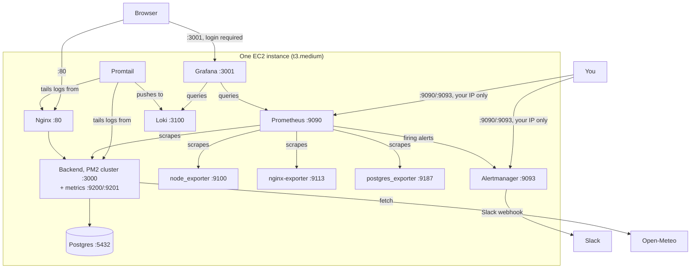

| Component | Job | Inspect it |
|---|---|---|
| node_exporter | server metrics | `curl localhost:9100/metrics` |
| nginx-exporter | Nginx request/status metrics | `curl localhost:9113/metrics` |
| postgres_exporter | Postgres internals | `curl localhost:9187/metrics` |
| backend `:9200`/`:9201` | HTTP + business metrics, per worker | `curl localhost:9200/metrics` |
| Prometheus | scrapes everything, evaluates alert rules | `http://<ip>:9090` |
| Alertmanager | routes firing alerts to Slack | `http://<ip>:9093` |
| Loki + Promtail | log storage + shipping | Grafana → Explore → Loki |
| Grafana | dashboards over Prometheus + Loki | `http://<ip>:3001` |

**Cleanup:** everything in Parts 3–4 lives on the same instance and the same
security group Parts 1–2 already tear down completely — there is nothing new
to add. Just run:

```bash
scripts/cleanup.sh
```

and re-verify exactly as in §11/§21 (`describe-instances`, `describe-security-groups`,
`iam get-role`, `aws s3 ls` all coming back empty). If you minted a Slack
webhook for §37, remove it from the Slack app's settings too — the app is
gone, but the webhook itself lives in Slack until you delete it there.

---

## Where this goes next

- **Docker:** package each tier (and the monitoring stack) as containers;
  deploy with `docker compose` instead of PM2 + apt-installed binaries.
- **A real domain + HTTPS:** certbot in front of Nginx, same pattern as many
  reference deployments — deliberately left out here to keep the AWS surface
  small for a frontend-focused class.
- **Split the tiers (and monitoring) across instances:** once "why one VM"
  (§12) makes sense, try separating them as a follow-on exercise — including
  putting Prometheus/Grafana on their own box, the more common real-world
  shape (monitoring shouldn't share fate with what it monitors).
- **Grafana Alloy:** Promtail (§36) is in maintenance mode; Grafana's
  actively-developed replacement is worth a look once Promtail's model makes
  sense.
